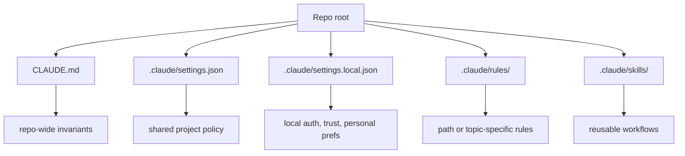

# Claude Code Setup and Repo Contracts

Setting up Claude Code well means defining a clear project contract, splitting always-on instructions from reusable workflows, and enforcing the dangerous edges with permissions and hooks rather than hope.

> [!INFO] Core idea
> Claude Code works best when `CLAUDE.md` stays short, `.claude` carries the local project machinery, and hooks or permissions enforce the rules the model should not be trusted to police by itself.

## Why It Matters
Claude Code is powerful enough to feel productive even in a weak setup. That is exactly why repo contracts matter. If instructions, permissions, and workflow reuse are not explicit, the tool will still move fast, but it will do so with inconsistent safety and poor repeatability.

## Strong Vs Weak Setup
| Setup Quality | What It Looks Like | Likely Result |
| :--- | :--- | :--- |
| strong | `CLAUDE.md` is short, shared settings are versioned, local trust stays local, hooks enforce sensitive boundaries | predictable behavior across teammates |
| weak | giant root prompt, duplicated rules, no hook policy, and no worktree discipline | fast first run, then drift and surprises |

> [!IMPORTANT] Keep the shared contract small
> `CLAUDE.md` is always-on context. If a line does not reliably change behavior, it does not belong there. Move verbose procedures into skills, rules, scripts, or supporting docs.

## Recommended Layout

## Repo Contract Layers
| Layer | Best Use | Avoid |
| :--- | :--- | :--- |
| `CLAUDE.md` | commands, architecture invariants, workflow rules, key gotchas | long tutorials, every fact about the repo |
| `.claude/settings.json` | shared project defaults and permission posture | local auth and user-specific preferences |
| `.claude/settings.local.json` | local trust, user-specific settings, auth | versioning team-wide policy here |
| `.claude/rules/` | scoped rules by domain or path | copying the same global rules into many files |
| skills | reusable procedures and playbooks | static facts that should always be on |
| hooks | enforcement, blocking, validation | soft suggestions the model may ignore |

## Practical Setup Sequence
1. install Claude Code without `sudo` and run `claude doctor`
2. run `/init` so the project contract starts from an explicit baseline
3. keep `CLAUDE.md` in git and add only high-leverage instructions
4. commit shared `.claude/settings.json` if the team should share the same posture
5. keep `.claude/settings.local.json` unshared for local trust and auth
6. add skills for repeated workflows before enlarging `CLAUDE.md`
7. add hooks once you know which risky actions must be enforced
8. move multi-session work into named worktrees before parallelizing heavily

## Permission Posture
| Goal | Healthy Default | Notes |
| :--- | :--- | :--- |
| routine repo work | `acceptEdits` or `auto` plus explicit deny rules | good balance of speed and control |
| risky local operations | hook gate plus permission ask | better than relying on prompt warnings |
| secrets or prod paths | deny by default | do not treat these as ordinary workflow steps |
| full autonomy | isolated container or VM only | `bypassPermissions` should be exceptional |

> [!WARNING] Shared settings and local trust are different things
> The repository should carry shared working policy. Personal trust levels, auth, and user-specific comfort settings belong in the local layer, not in the team contract.

## Hooks And Skills
| Surface | Use It For |
| :--- | :--- |
| `PreToolUse` | block dangerous commands, paths, or actions before they happen |
| `PostToolUse` | run format, lint, or lightweight validation after edits |
| stop or agent hooks | final checks, summaries, or required cleanup |
| skills | repeatable workflows, checklists, and procedures with supporting files |

## Practical Defaults
- if you already use `AGENTS.md`, make `CLAUDE.md` a thin shim with `@AGENTS.md` plus Claude-specific behavior
- keep one worktree for review or analysis and separate writer sessions by task
- prefer a small set of stable skills over many brittle ones
- use hooks for enforcement and skills for reusable workflows
- reset or compact long sessions before they become accidental memory stores

> [!TIP] Good starter contract
> The best V1 Claude Code contract is short: how to search the repo, how to validate changes, which files or commands are risky, and what a finished handoff must include.

## Failure Modes
- turning `CLAUDE.md` into a dump of every repo detail
- versioning local auth or trust decisions in shared project settings
- using hooks for advisory guidance that belongs in a skill or repo contract
- parallelizing sessions without path ownership and handoff discipline
- assuming a worktree solves coordination by itself

## Related Notes
- Prerequisites: [[090 Operating Agentic Coding Environments|Operating Agentic Coding Environments]], [[120 Writing Effective CLAUDE and AGENTS Contracts|Writing Effective CLAUDE and AGENTS Contracts]]
- Related: [[130 Skills, Commands, and Hooks in Practice|Skills, Commands, and Hooks in Practice]], [[140 Context Engineering and Session Hygiene for Coding Agents|Context Engineering and Session Hygiene for Coding Agents]], [[150 Parallel Sessions, Worktrees, and Multi-Agent Workflows|Parallel Sessions, Worktrees, and Multi-Agent Workflows]], [[030 Approvals, Permissions, and Sandboxing for Coding Agents|Approvals, Permissions, and Sandboxing for Coding Agents]]

## Sources
- [Getting started with Claude Code | Anthropic Docs](https://docs.anthropic.com/en/docs/claude-code/setup)
- [Claude Code best practices | Claude Code Docs](https://code.claude.com/docs/en/best-practices)
- [Claude Code memory | Claude Code Docs](https://code.claude.com/docs/en/memory)
- [Claude Code permissions | Claude Code Docs](https://code.claude.com/docs/en/permissions)
- [Claude Code hooks guide | Claude Code Docs](https://code.claude.com/docs/en/hooks-guide)
- [Claude Code common workflows | Claude Code Docs](https://code.claude.com/docs/en/common-workflows)
- [Claude Code: Best practices for agentic coding | Anthropic](https://www.anthropic.com/engineering/claude-code-best-practices?curius=1527)
- [ChrisWiles/claude-code-showcase | GitHub](https://github.com/ChrisWiles/claude-code-showcase)
- See [[010 Agentic Systems Sources and Research Log|Agentic Systems Sources and Research Log]]

## Last Reviewed
- 2026-04-20
