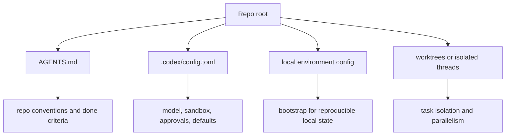

# Codex Setup and Repo Contracts

Setting up Codex well means separating repo instructions from runtime configuration, choosing a safe approval posture, and treating worktrees and session hygiene as operating primitives rather than optional extras.

> [!INFO] Core idea
> In Codex, the repo contract belongs in `AGENTS.md`, the deterministic runtime defaults belong in `.codex/config.toml` or local environment config, and parallel work belongs in isolated worktrees or threads.

## Why It Matters
Codex can work across CLI, IDE, app, and worktree-backed task surfaces. That flexibility is useful, but it also means a weak repo contract or vague approval model can create inconsistency faster than a simpler assistant ever could.

## Strong Vs Weak Setup
| Setup Quality | What It Looks Like | Likely Result |
| :--- | :--- | :--- |
| strong | short `AGENTS.md`, deterministic config, explicit worktree pattern, clear approval stance | stable behavior across sessions and teammates |
| weak | prompt-only conventions, no config baseline, shared branch collisions, implicit session state | fragile parallel work and inconsistent safety |

> [!IMPORTANT] Keep critical instructions in the repo
> Codex supports hierarchical `AGENTS.md`, including inherited global guidance. Even so, team-critical instructions should still live in the repository for auditability, shared behavior, and easier review of contract changes.

## Contract Stack

## Repo Contract Layers
| Layer | Best Use | Avoid |
| :--- | :--- | :--- |
| `AGENTS.md` | repo norms, validation rules, note or code conventions, done criteria | unstable user-specific preferences |
| nested `AGENTS.md` | narrower path-specific overrides | conflicting copies of global repo policy |
| `.codex/config.toml` | deterministic defaults for model, sandbox, approvals, and tools | long narrative instructions |
| local environments | reproducible bootstrap for worktrees or tasks | undocumented one-off shell knowledge |
| worktrees | isolation for real parallelism | using the same branch in multiple active sessions |

## Practical Defaults
| Decision | Recommended Default | Why |
| :--- | :--- | :--- |
| sandbox | `workspace-write` | practical local default with bounded write access |
| approvals | `on-request` or `untrusted` | safer than broad autonomy while preserving flow |
| session style | short task brief plus explicit artifact handoff | lowers hidden state in long sessions |
| branching | create a branch only when the work should be kept | works well with detached or disposable worktrees |

## App Vs CLI Reality
| Surface | Strength | Current Limitation |
| :--- | :--- | :--- |
| Codex app | worktrees, isolated threads, handoff flow, automation surfaces | more product-mediated workflow |
| Codex CLI | direct terminal control and lightweight iteration | parallelism is still mostly manual with `git worktree add` and separate processes |

> [!WARNING] Granularity does not remove operational friction
> Current approval controls are more granular than early Codex releases, but practitioners still report friction around grouping, UX, and command boundaries. If a command is high risk, package it in explicit scripts or keep it behind a clear review boundary.

## Session And Worktree Hygiene
- externalize important state into branches, worktree names, and short repo artifacts
- use `/fork` when you are exploring alternatives, not when you need one linear task history
- use `/resume` to continue real work, not to rediscover a forgotten task from memory alone
- do not assume any long session ID is a durable artifact store
- keep one task per worktree when the write scope matters

## Handoff Rules
| Handoff Element | Why It Matters |
| :--- | :--- |
| scope touched | helps the next session avoid rediscovery |
| assumptions | exposes hidden dependencies or local reasoning |
| validation run | separates changed files from verified behavior |
| next step | reduces ambiguous resume behavior |

> [!TIP] Best starter posture
> A good V1 Codex setup is one repo-level `AGENTS.md`, one deterministic config baseline, one safe approval mode, and one worktree per meaningful task.

## Failure Modes
- hiding the actual repo contract in user-global config
- overloading `AGENTS.md` with runtime defaults that belong in config
- running parallel tasks in the same checkout
- depending on session memory instead of explicit handoffs
- granting broad autonomy before the review and rollback path is mature

## Related Notes
- Prerequisites: [[090 Operating Agentic Coding Environments|Operating Agentic Coding Environments]], [[120 Writing Effective CLAUDE and AGENTS Contracts|Writing Effective CLAUDE and AGENTS Contracts]]
- Related: [[150 Parallel Sessions, Worktrees, and Multi-Agent Workflows|Parallel Sessions, Worktrees, and Multi-Agent Workflows]], [[140 Context Engineering and Session Hygiene for Coding Agents|Context Engineering and Session Hygiene for Coding Agents]], [[030 Approvals, Permissions, and Sandboxing for Coding Agents|Approvals, Permissions, and Sandboxing for Coding Agents]], [[060 Building Coding Agent Harnesses|Building Coding Agent Harnesses]]

## Sources
- [AGENTS.md | OpenAI Developers](https://developers.openai.com/codex/guides/agents-md)
- [Agent approvals and security | OpenAI Developers](https://developers.openai.com/codex/agent-approvals-security)
- [Worktrees | Codex App Docs](https://developers.openai.com/codex/app/worktrees)
- [Local environments | Codex App Docs](https://developers.openai.com/codex/app/local-environments)
- [Config basics | OpenAI Developers](https://developers.openai.com/codex/config-basic)
- [Subagents | OpenAI Developers](https://developers.openai.com/codex/subagents)
- [Introducing the Codex app | OpenAI](https://openai.com/index/introducing-the-codex-app/)
- [Unlocking the Codex harness: how we built the App Server | OpenAI](https://openai.com/index/unlocking-the-codex-harness/)
- [Codex CLI Lacks Worktrees: manual parallelism patterns](https://www.frr.dev/posts/codex-cli-worktrees-manual-parallelism/)
- See [[010 Agentic Systems Sources and Research Log|Agentic Systems Sources and Research Log]]

## Last Reviewed
- 2026-04-20
