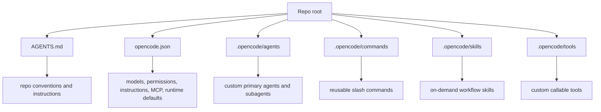

# OpenCode Setup and Repo Contracts

Setting up `OpenCode` well means treating `AGENTS.md` as the repo contract, `opencode.json` as the runtime control layer, and `.opencode/` as the place where reusable workflows, agents, commands, and tools become explicit project infrastructure.

> [!INFO] Core idea
> `OpenCode` is strong when the contract is layered cleanly: `AGENTS.md` for repo instructions, `opencode.json` for merged config and permissions, and `.opencode/` for the project-local machinery that should not live in always-on prompt space.

## Why It Matters
`OpenCode` is attractive because it is open, model-agnostic, and already designed around multiple agents, commands, skills, and permissions. That flexibility is useful, but it also means weak repo setup turns into inconsistent behavior quickly if rules, config, and subagent surfaces are not clearly separated.

## Strong Vs Weak Setup
| Setup Quality | What It Looks Like | Likely Result |
| :--- | :--- | :--- |
| strong | short `AGENTS.md`, explicit `opencode.json`, scoped permissions, reusable `.opencode` assets | repeatable behavior across sessions and contributors |
| weak | everything in one prompt, permissive defaults left untouched, no project commands or skill hygiene | fast demos, then drift, accidental edits, and noisy sessions |

> [!IMPORTANT] OpenCode is contract-heavy
> Unlike tools that concentrate more behavior in one root prompt file, `OpenCode` expects several layers to cooperate: `AGENTS.md`, config precedence, permissions, agents, commands, and skills.

## Contract Stack

## Where Things Belong
| Layer | Best Use | Avoid |
| :--- | :--- | :--- |
| `AGENTS.md` | repo conventions, validation commands, architecture and workflow gotchas | large procedures, transient task detail, permissive local preferences |
| `opencode.json` | config precedence, model/provider defaults, permissions, instructions, MCP, agents, commands | long prose guidance better expressed as markdown or skills |
| `.opencode/agents/` | custom primary agents or subagents with narrower roles | replacing clear repo instructions with agent sprawl |
| `.opencode/commands/` | slash commands for repeated prompts or subtask launchers | hidden policy or ambiguous side effects |
| `.opencode/skills/` | reusable on-demand workflows via `SKILL.md` | static facts that should always be in the repo contract |
| `.opencode/tools/` | custom tool interfaces callable by the model | everything that should have stayed a shell script or command |

## OpenCode-Specific Advantages
| Capability | Why It Matters |
| :--- | :--- |
| merged config precedence | lets remote, global, project, and inline config combine instead of replace |
| `AGENTS.md` first, `CLAUDE.md` fallback | works well for mixed-tool repos and migration from Claude Code |
| built-in primary and subagents | makes plan/build and delegated exploration first-class surfaces |
| pattern-based permissions | allows narrower control over `bash`, `edit`, `task`, `skill`, and external-directory access |
| `.opencode` project directories | gives local structure for commands, skills, agents, tools, and plugins |

> [!WARNING] Defaults are permissive
> `OpenCode` starts from relatively permissive defaults. If you care about safe repo work, you should tighten `permission` explicitly instead of assuming the runtime will ask before risky actions.

## Built-In Agent Model
| Agent | Mode | Best Use |
| :--- | :--- | :--- |
| Build | primary | normal coding work with broad tool access |
| Plan | primary | analysis or planning without making immediate changes |
| General | subagent | delegated multi-step work with broad tool access |
| Explore | subagent | fast read-only exploration and codebase scouting |

## Practical Defaults
| Decision | Recommended Default | Why |
| :--- | :--- | :--- |
| repo rules | commit `AGENTS.md` to git | team-visible contract for future sessions |
| project config | keep `opencode.json` in repo root | project-level defaults should beat user-global preferences |
| permissions | start from `ask` for `bash`, `edit`, `task`, and `external_directory` where risk matters | avoids inheriting permissive runtime behavior blindly |
| external instructions | prefer `instructions` in `opencode.json` for modular rule files | cleaner than overloading `AGENTS.md` with everything |
| compatibility | use `CLAUDE.md` only as fallback or compatibility bridge | `OpenCode` treats `AGENTS.md` as the primary rule file |

## Commands, Skills, And Compatibility
- `OpenCode` can load skills from `.opencode/skills/`, `.claude/skills/`, and `.agents/skills/`
- project commands live naturally in `.opencode/commands/`
- `AGENTS.md` is preferred over `CLAUDE.md` when both exist
- `instructions` in `opencode.json` can pull in markdown files or remote URLs without bloating the root contract

> [!TIP] Best starter posture
> A good V1 `OpenCode` setup is one shared `AGENTS.md`, one explicit `opencode.json`, one tightened permission posture, and one small set of project commands or skills instead of a huge root prompt.

## Failure Modes
- relying on permissive defaults and discovering the risk too late
- duplicating the same guidance across `AGENTS.md`, `CLAUDE.md`, and `instructions`
- creating many custom agents before one solid build and plan workflow exists
- turning commands into hidden policy rather than reusable prompts
- forgetting that subagents still need scope and ownership discipline

## Related Notes
- Prerequisites: [[090 Operating Agentic Coding Environments|Operating Agentic Coding Environments]], [[120 Writing Effective CLAUDE and AGENTS Contracts|Writing Effective CLAUDE and AGENTS Contracts]]
- Related: [[130 Skills, Commands, and Hooks in Practice|Skills, Commands, and Hooks in Practice]], [[150 Parallel Sessions, Worktrees, and Multi-Agent Workflows|Parallel Sessions, Worktrees, and Multi-Agent Workflows]], [[160 Tool Design and MCP Integration in Practice|Tool Design and MCP Integration in Practice]], [[030 Approvals, Permissions, and Sandboxing for Coding Agents|Approvals, Permissions, and Sandboxing for Coding Agents]]

## Sources
- [OpenCode Intro](https://opencode.ai/docs/)
- [OpenCode Config](https://opencode.ai/docs/config/)
- [OpenCode Rules](https://opencode.ai/docs/rules/)
- [OpenCode Permissions](https://opencode.ai/docs/permissions/)
- [OpenCode Agents](https://opencode.ai/docs/agents/)
- [OpenCode Commands](https://opencode.ai/docs/commands/)
- [OpenCode Agent Skills](https://opencode.ai/docs/skills)
- [anomalyco/opencode | GitHub](https://github.com/anomalyco/opencode)
- See [[010 Agentic Systems Sources and Research Log|Agentic Systems Sources and Research Log]]

## Last Reviewed
- 2026-04-20
