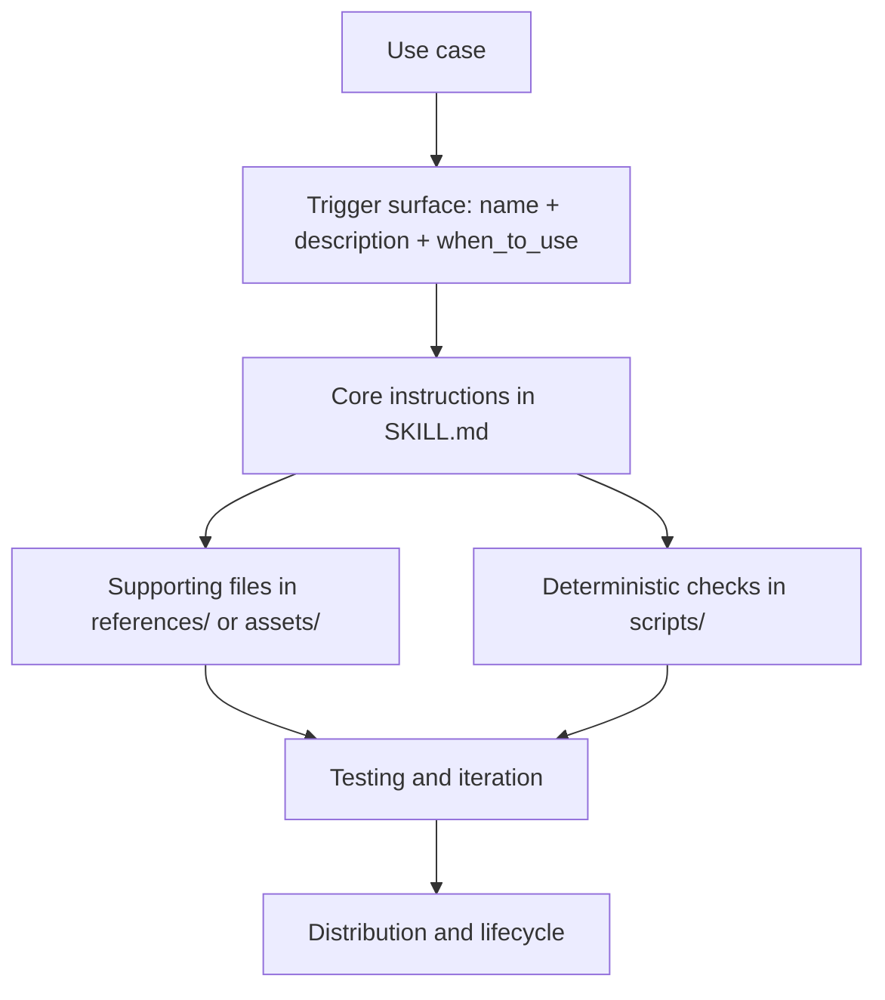
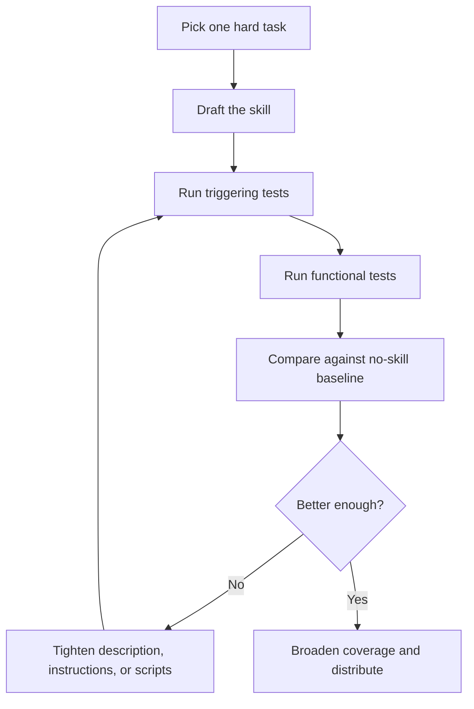

# Building Effective Skills for Claude

Building a good Claude skill is not mainly a prompting exercise. It is a packaging problem: define the trigger surface cleanly, keep the core instructions small, push bulk detail into supporting files or scripts, and test whether the skill actually improves the workflow instead of only sounding smart.

> [!INFO] Core idea
> A skill should package reusable procedure and domain-specific workflow, not permanent repo facts and not hard policy. If it needs to be always on, it probably belongs in `CLAUDE.md` or `AGENTS.md`. If it must be enforced, it probably belongs in hooks or permissions.

> [!IMPORTANT] Portable core, tool-specific extensions
> The open `Agent Skills` format is the stable base: `SKILL.md` plus optional supporting files. Claude Code then adds a richer layer with fields such as `when_to_use`, `disable-model-invocation`, `allowed-tools`, `paths`, and `context: fork`.

> [!WARNING] The easiest mistake is writing a giant `SKILL.md`
> Oversized skill files degrade triggering quality and context efficiency. Keep the core instructions narrow, push reference material into `references/`, and use scripts for deterministic checks instead of long advisory prose.

## Why It Matters
Teams often understand that skills are useful, but still build weak ones. The common failure mode is a skill that looks like a helpful markdown file but behaves badly in practice: it under-triggers, over-triggers, hides too much logic in prose, or carries so much detail that the model stops following it cleanly. The right goal is not “a clever skill.” The goal is a skill that is cheap to load, clear to trigger, easy to maintain, and visibly better than the baseline workflow without it.

## Skill Stack

## What A Skill Should Own
| Layer | Put It In A Skill? | Better Home If Not |
| :--- | :--- | :--- |
| repeatable multi-step workflow | yes | n/a |
| domain-specific procedure | yes | n/a |
| supporting examples and templates | yes, in `references/` or `assets/` | n/a |
| permanent repo invariants | no | `CLAUDE.md` or `AGENTS.md` |
| hard enforcement or blocked actions | no | hooks, permissions, config |
| highly volatile task detail | no | current prompt or task artifact |

## Folder Design
| Item | Role | Notes |
| :--- | :--- | :--- |
| `SKILL.md` | required entrypoint | exact case matters |
| `scripts/` | deterministic helpers | best for validation, transforms, or repeatable generation |
| `references/` | on-demand detail | API guides, examples, checklists, edge cases |
| `assets/` | output resources | templates, icons, boilerplates, brand files |

### Naming Rules
- keep the skill folder in `kebab-case`
- keep the `name` field aligned with the folder name unless the host tool has a good reason to diverge
- do not place `README.md` inside the skill folder
- keep human-facing repo documentation at repo level, not inside the skill package

> [!TIP] Practical default
> If a skill needs many pages of explanation before it can help, the packaging is probably wrong. Move the bulk into `references/`, not into the always-loaded trigger layer.

## Frontmatter Design
### Portable core
| Field | Why It Matters |
| :--- | :--- |
| `name` | stable identifier and slash-command surface |
| `description` | first trigger contract for automatic invocation |
| `license` | useful for open distribution |
| `metadata` | author, version, category, or integration hints |

### Claude Code extensions
| Field | Use It For | Caution |
| :--- | :--- | :--- |
| `when_to_use` | extra trigger phrases and invocation context | do not repeat the whole description |
| `disable-model-invocation` | manual-only skills | use for workflows you want invoked explicitly |
| `allowed-tools` | bounded power while the skill is active | avoid widening tool scope casually |
| `paths` | auto-load only for matching files | strong for monorepos and package-local skills |
| `context: fork` and `agent` | run the skill in a subagent | use only when isolation is materially helpful |
| `hooks` | skill-scoped lifecycle hooks | useful, but keep policy readable elsewhere too |

## Description Design
The trigger surface should answer three questions in one short unit:
1. what the skill does
2. when it should be used
3. what kinds of requests or phrases should activate it

### Good vs weak descriptions
| Description Shape | Outcome |
| :--- | :--- |
| concrete workflow, real user phrases, clear output | stronger triggering and lower confusion |
| vague capability statement with no usage language | under-triggering |
| broad technical words without user-language cues | weak adoption and inconsistent load behavior |

### Trigger design rules
- front-load the core use case
- include words users would actually say, not only internal jargon
- mention file types or artifacts when they matter
- add negative scope when the skill is otherwise too broad
- keep the trigger contract short enough that the model can retain it reliably

## Instruction Design
| Pattern | Why It Works |
| :--- | :--- |
| numbered workflow steps | reduces ambiguity in multi-step tasks |
| explicit error handling | keeps failures from turning into silent drift |
| linked references | enables progressive disclosure instead of inline bloat |
| examples and example outputs | teaches format and completion shape quickly |
| scripts for deterministic checks | replaces fragile prose-only validation |

### Good structure for `SKILL.md`
1. brief title and purpose
2. critical workflow steps
3. required validations or stop rules
4. examples
5. troubleshooting or common issues
6. links to supporting files when needed

> [!CAUTION] Do not let prose act like a validator
> If the task needs exact checks, write a script or use a tool. Language instructions are good for procedure; they are weak at deterministic validation.

## Design Choice: Problem-First vs Tool-First
| Framing | Best When | Example |
| :--- | :--- | :--- |
| problem-first | the user describes an outcome and the skill should orchestrate tools | `set up a sprint plan`, `generate a compliance report` |
| tool-first | the user already has a connector or environment and needs expert workflow guidance | `use Linear well`, `use Figma MCP for handoff` |

Most strong skills lean clearly one way. Confused skills often mix both frames and end up with muddy triggers.

## Testing Matrix
| Test Type | What To Check | Failure Signal |
| :--- | :--- | :--- |
| triggering | loads on obvious and paraphrased requests, not on unrelated tasks | under- or over-triggering |
| functional | output is correct, tools succeed, edge cases behave | brittle instructions or weak error handling |
| baseline comparison | better messages, fewer retries, lower correction burden | the skill sounds useful but adds little value |

### Practical iteration loop

## Distribution And Scope
| Surface | Best Use |
| :--- | :--- |
| project skill | repo-local workflow in `.claude/skills/` |
| personal skill | repeated workflow across many repos |
| plugin skill | shared distribution through a plugin |
| managed or enterprise skill | org-wide standardization |
| Claude.ai upload | direct end-user use and quick iteration |
| API use | production pipelines, applications, or agent systems |

### Sharing rules that age well
- host shared skills in GitHub or another versioned repo
- keep a repo-level `README.md` for humans, install steps, and screenshots
- keep the skill folder itself focused on the portable runtime artifact
- version the skill explicitly when teams rely on it
- document compatibility assumptions when the skill depends on network, packages, or MCP availability

## Common Failure Modes
- using the skill as a dump for everything that does not fit elsewhere
- describing the capability without saying when to use it
- putting too much detail in `SKILL.md` instead of `references/`
- relying on prose for deterministic checks
- skipping baseline comparison and assuming the skill helps because it sounds sophisticated
- enabling too many broad skills at once and then blaming the model for poor context quality

## Review Checklist
| Question | Good Answer |
| :--- | :--- |
| does the trigger surface clearly state what and when? | yes, in user language |
| does the skill own a repeatable workflow rather than permanent facts? | yes |
| are bulky details pushed into supporting files? | yes |
| are deterministic checks scripted where needed? | yes |
| do triggering and functional tests both exist? | yes |
| is there a clear sharing path if others should use it? | yes |

## Related Notes
- Prerequisites: [[090 Operating Agentic Coding Environments|Operating Agentic Coding Environments]], [[120 Writing Effective CLAUDE and AGENTS Contracts|Writing Effective CLAUDE and AGENTS Contracts]]
- Related: [[100 Claude Code Setup and Repo Contracts|Claude Code Setup and Repo Contracts]], [[130 Skills, Commands, and Hooks in Practice|Skills, Commands, and Hooks in Practice]], [[140 Context Engineering and Session Hygiene for Coding Agents|Context Engineering and Session Hygiene for Coding Agents]], [[160 Tool Design and MCP Integration in Practice|Tool Design and MCP Integration in Practice]]

## Sources
- [[2026-01-26 The Complete Guide to Building Skills for Claude|The Complete Guide to Building Skills for Claude]]
- [Extend Claude with skills | Claude Code Docs](https://code.claude.com/docs/en/skills)
- [Agent Skills Overview](https://agentskills.io/)
- [anthropics/skills | GitHub](https://github.com/anthropics/skills)
- [Claude Code best practices | Claude Code Docs](https://code.claude.com/docs/en/best-practices)

## Last Reviewed
- 2026-04-21
