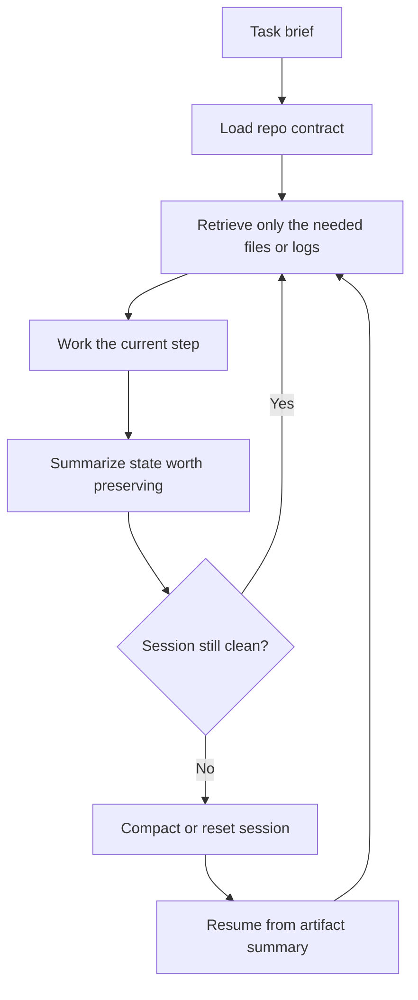

# Context Engineering and Session Hygiene for Coding Agents

Context engineering is the practice of deciding what should be loaded, preserved, summarized, or dropped so the coding agent sees the right working state without drowning in stale detail.

> [!INFO] Core idea
> One common failure in long coding-agent sessions is not missing context but unmanaged context growth. The harder problem is deciding what still deserves to stay in context after many turns, tool results, retries, and partial plans.

## Why It Matters
Coding agents break down when temporary context silently becomes permanent memory. Long sessions begin to overfit to outdated assumptions, old tool results, and unfinished branches of reasoning. Good context engineering keeps the working set small, fresh, and inspectable.

## Context Stack
| Layer | What Belongs There | How Long It Should Live |
| :--- | :--- | :--- |
| repo contract | stable rules, commands, architecture invariants | across many sessions |
| task brief | current objective, scope, success criteria | one task or branch of work |
| just-in-time retrieval | file excerpts, logs, issue text, trace slices | only while actively needed |
| artifact summary | compact handoff of what changed and why | until the next handoff or review |
| local memory | user or environment preferences that may help later | advisory, never absolute |

> [!IMPORTANT] Treat memory as advisory
> Current user intent should win over stored memory. Good setups track not just recall, but whether memory over-influences the session or causes conflicts with current instructions.

## Healthy Session Loop

## Practical Rules
| Problem | Better Move |
| :--- | :--- |
| large repo | keep paths, queries, and file names in context, not every file body |
| repeated failures | clear or fork the session before retrying the same loop again |
| long-running task | preserve short artifacts: scope, edits, validation, next step |
| memory conflicts | measure recency correctness and conflict rate, not recall alone |
| heavy research | use subagents or separate sessions instead of bloating one thread |

## Handoff Hygiene
A useful handoff should answer:
- what scope was touched
- what assumptions are still active
- what validation already ran
- what remains unresolved
- what the next operator should do first

> [!WARNING] Context bloat often looks like productivity
> A long session can feel rich and informed while actually becoming less accurate. When the thread is full of stale tool output and abandoned plans, the agent may become confidently wrong rather than obviously confused.

## Metrics Worth Tracking
| Metric | Why It Helps |
| :--- | :--- |
| recency correctness | shows whether the agent is honoring the latest instruction state |
| memory conflict rate | catches advisory memory overriding live intent |
| unnecessary turns | reveals bloated context or weak workflow decomposition |
| retrieval precision | shows whether the agent is loading the right supporting context |

> [!TIP] Practical default
> Prefer path references and compact summaries over pasting large documents. Load the heavy artifact only when the current step truly needs it.

## Failure Modes
- using the main thread as a permanent notebook
- preloading large bodies of text instead of retrieving them when needed
- mixing stable repo rules with temporary task debate
- resuming sessions without a clean artifact summary
- trusting memory even when the user just changed direction

## Related Notes
- Prerequisites: [[090 Operating Agentic Coding Environments|Operating Agentic Coding Environments]], [[120 Writing Effective CLAUDE and AGENTS Contracts|Writing Effective CLAUDE and AGENTS Contracts]]
- Related: [[130 Skills, Commands, and Hooks in Practice|Skills, Commands, and Hooks in Practice]], [[150 Parallel Sessions, Worktrees, and Multi-Agent Workflows|Parallel Sessions, Worktrees, and Multi-Agent Workflows]], [[170 Eval Hygiene for Agentic Coding Systems|Eval Hygiene for Agentic Coding Systems]], [[070 Memory in Agent Systems|Memory in Agent Systems]]

## Sources
- [Effective context engineering for AI agents | Anthropic](https://www.anthropic.com/engineering/effective-context-engineering-for-ai-agents)
- [Building Effective AI Agents | Anthropic](https://www.anthropic.com/engineering/building-effective-agents)
- [Context Engineering for Personalization and Memory Evals | OpenAI Cookbook](https://developers.openai.com/cookbook/examples/agents_sdk/context_personalization)
- [Claude Code memory | Claude Code Docs](https://code.claude.com/docs/en/memory)
- [How We Build Effective Agents | Barry Zhang, Anthropic](https://www.youtube.com/watch?v=D7_ipDqhtwk)
- See [[010 Agentic Systems Sources and Research Log|Agentic Systems Sources and Research Log]]

## Last Reviewed
- 2026-04-20
