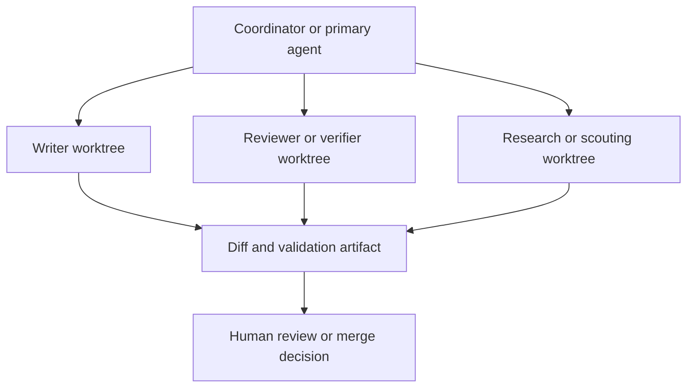

# Parallel Sessions, Worktrees, and Multi-Agent Workflows

Parallel coding with agents works when filesystem isolation, role ownership, and handoff discipline stay aligned. If any one of those is weak, the parallelism usually becomes merge debt disguised as throughput.

> [!INFO] Core idea
> Worktrees isolate files, not intent. Multi-agent workflows only become reliable when each session owns a bounded scope and leaves a handoff artifact another session can actually trust.

## Why It Matters
One bounded agent can solve a surprising amount of repo work. Parallelism should be used when the task naturally decomposes, when review can run independently, or when waiting on long-running steps would otherwise stall progress.

## Role Split Pattern

> [!IMPORTANT] Ownership beats enthusiasm
> The easiest way to make parallel agents useful is to give each one a narrow file or responsibility scope. Without that, they only shift conflict from execution time to merge time.

## When Parallelism Helps
| Situation | Good Split |
| :--- | :--- |
| large task with separable write scopes | one writer per file family or module |
| expensive review burden | writer plus verifier or reviewer split |
| long-running validation | continue local work while another session waits on CI or tooling |
| broad repo research | one research session plus one implementing session |

## Escalation Path
| If One Session Is Not Enough Because... | Next Step |
| :--- | :--- |
| the same procedure repeats often | build a skill or command first |
| the workflow needs hard enforcement | add hooks or policy, not more agents |
| you need isolated context or independent review | add a subagent or separate session |
| several write scopes can move in parallel | move into worktrees with ownership and handoff rules |

## When Not To Parallelize
| Situation | Better Move |
| :--- | :--- |
| one small local fix | keep one agent and finish it cleanly |
| highly coupled multi-file change | sequence the work instead of splitting it prematurely |
| unclear ownership | define scope first or stay single-threaded |
| unstable task definition | clarify the contract before spawning more workers |

## Platform Notes
| Surface | Practical Pattern |
| :--- | :--- |
| Claude Code | named worktrees, 3 to 5 concurrent sessions at most, separate writer and reviewer sessions |
| Codex app | isolated threads and worktrees, detached or disposable worktrees first, keep branches only when results are worth preserving |
| Codex CLI | manual `git worktree add` plus one process per directory, with explicit handoff artifacts |
| OpenCode | built-in Build and Plan primary agents plus General and Explore subagents, with multi-session work best kept behind explicit scope ownership and permission tuning |

> [!WARNING] Same repo does not mean same branch
> Git does not let the same branch stay checked out in multiple active worktrees. Treat worktree creation and branch ownership as part of the operating model, not as incidental git trivia.

## Handoff Contract
| Field | Why It Matters |
| :--- | :--- |
| scope owned | reduces overlap and conflict |
| files touched | helps review and merge planning |
| assumptions | exposes hidden dependencies |
| validation run | clarifies what is actually checked |
| next step | turns resume into execution instead of rediscovery |

## Stop Rules
- stop parallelizing when the coordination cost exceeds the actual write cost
- stop if two agents need to touch the same core files repeatedly
- stop if the human reviewer can no longer tell which artifact belongs to which worker
- stop if a worker cannot explain its state in a short handoff

> [!TIP] Practical default
> Start with a writer plus reviewer split or a writer plus researcher split. Only move to larger teams when the task decomposition is already stable.

## Failure Modes
- many agents, one shared write scope
- no handoff artifacts beyond chat history
- parallel branches without merge discipline
- confusing role diversity with genuine task decomposition
- using multi-agent as a substitute for a weak base workflow

## Related Notes
- Prerequisites: [[090 Operating Agentic Coding Environments|Operating Agentic Coding Environments]], [[065 Delegation and Role Specialization|Delegation and Role Specialization]]
- Related: [[100 Claude Code Setup and Repo Contracts|Claude Code Setup and Repo Contracts]], [[110 Codex Setup and Repo Contracts|Codex Setup and Repo Contracts]], [[130 Skills, Commands, and Hooks in Practice|Skills, Commands, and Hooks in Practice]], [[140 Context Engineering and Session Hygiene for Coding Agents|Context Engineering and Session Hygiene for Coding Agents]], [[070 Long-Running and Background Coding Agents|Long-Running and Background Coding Agents]], [[080 Operating Coding Agents in Teams|Operating Coding Agents in Teams]]

## Sources
- [Agent teams | Claude Code Docs](https://code.claude.com/docs/en/agent-teams)
- [Create custom subagents | Claude Code Docs](https://code.claude.com/docs/en/sub-agents)
- [Worktrees | Codex App Docs](https://developers.openai.com/codex/app/worktrees)
- [Subagents | OpenAI Developers](https://developers.openai.com/codex/subagents)
- [OpenCode Agents](https://opencode.ai/docs/agents/)
- [OpenCode Permissions](https://opencode.ai/docs/permissions/)
- [Building a C compiler with a team of parallel Claudes | Anthropic](https://www.anthropic.com/engineering/building-c-compiler)
- [5 Claude Code worktree tips from creator of Claude Code | Reddit](https://www.reddit.com/r/ClaudeCode/comments/1rae7sa/5_claude_code_worktree_tips_from_creator_of/)
- See [[010 Agentic Systems Sources and Research Log|Agentic Systems Sources and Research Log]]

## Last Reviewed
- 2026-04-20
