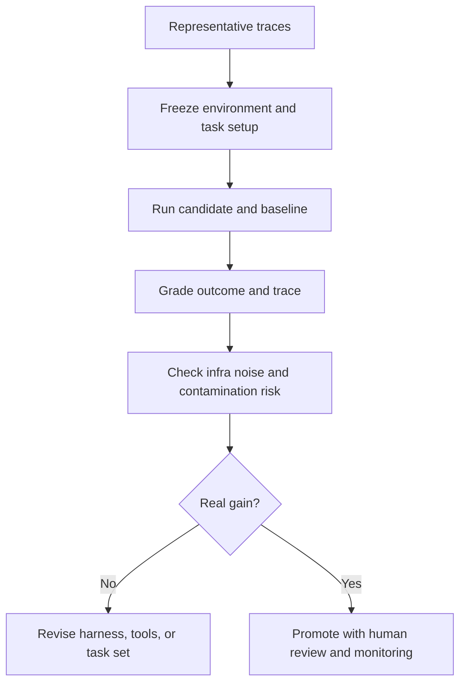

# Eval Hygiene for Agentic Coding Systems

Eval hygiene means designing coding-agent evaluation so that the result reflects real capability and workflow quality, not benchmark contamination, flaky infrastructure, or reviewer wishful thinking.

> [!INFO] Core idea
> A strong agentic coding eval grades more than “tests passed.” It also checks the trace, the workflow, the environment quality, and whether the benchmark still measures anything meaningful.

## Why It Matters
Coding-agent evaluation is easy to corrupt unintentionally. Public benchmarks saturate, infrastructure noise leaks into the score, and a strong harness can hide weak reviewer trust. Without eval hygiene, teams overestimate progress and ship brittle setups.

## What To Grade
| Layer | What To Check | Why It Matters |
| :--- | :--- | :--- |
| final outcome | correctness, tests, type checks, issue resolution | proves the task was actually solved |
| trace quality | tool choice, unnecessary turns, policy compliance | shows whether the workflow is efficient and controllable |
| environment quality | frozen images, reproducible toolchain, network assumptions | separates agent capability from infra luck |
| reviewability | clarity of diff, summaries, artifacts, and rollback path | an operator gate for real adoption, even if it is not a benchmark metric |

> [!IMPORTANT] Outcome plus trace
> Passing tests is necessary but not sufficient. Coding agents should also be graded on how they reached the result, especially when the system has powerful tools or costly review overhead.

## Healthy Eval Sequence

## Common Failure Sources
| Failure Source | Mitigation |
| :--- | :--- |
| infra noise | freeze images, toolchains, and network assumptions where possible |
| benchmark contamination | compare public sets with fresh or private tasks |
| weak reviewer trust | require readable diffs, summaries, and artifacts |
| harness inflation | compare model changes and scaffold changes separately |
| overfitted task set | keep a small representative trace set before scaling to a dataset |

## How This Differs From [[050 Evaluating Software Engineering Agents|Evaluating Software Engineering Agents]]
[[050 Evaluating Software Engineering Agents|Evaluating Software Engineering Agents]] is the broader note for evaluation design, task sets, and promotion criteria in coding agents. This note is narrower. It focuses on operator-side traps that distort evaluation even when the general framework is already sound:
- infrastructure noise
- benchmark contamination
- hidden environment differences
- confusing model gains with scaffold gains
- reviewability as an operational gate

## Coding-Agent Eval Rules
- start from real repo-local traces before building a large formal dataset
- score the baseline and the candidate in the same environment
- preserve artifacts, cost, time, and failure traces
- use private or fresh tasks when public benchmarks are saturated
- treat small leaderboard gains with suspicion if contamination risk is high

> [!WARNING] Public benchmark success can mislead
> Frontier coding agents can overfit public evaluation sets. A higher score on a tired benchmark does not guarantee better real-world software work.

## Promotion Gates
| Gate | Healthy Question |
| :--- | :--- |
| technical | did the system solve the task correctly and reproducibly? |
| operational | did the workflow stay within budget, latency, and policy bounds? |
| review | can a human reviewer understand and trust the artifact? |
| comparative | is the gain better than a simpler baseline, not just better than last week's run? |

> [!TIP] Practical default
> Use a small trace set to find failure modes first, then freeze a repeatable dataset only after you understand what the workflow is actually getting wrong.

## Failure Modes
- evaluating only the final patch and ignoring the trace
- letting network variance or flaky shells dominate the score
- comparing setups with different hidden environment assumptions
- trusting public benchmark gains without contamination checks
- ignoring reviewer effort while celebrating raw completion rate

## Related Notes
- Prerequisites: [[050 Evaluating Software Engineering Agents|Evaluating Software Engineering Agents]], [[100 Evaluation, Observability, and Governance for Agent Systems|Evaluation, Observability, and Governance for Agent Systems]]
- Related: [[140 Context Engineering and Session Hygiene for Coding Agents|Context Engineering and Session Hygiene for Coding Agents]], [[160 Tool Design and MCP Integration in Practice|Tool Design and MCP Integration in Practice]], [[080 Operating Coding Agents in Teams|Operating Coding Agents in Teams]], [[040 Validation and Eval Design for Agent Architectures|Validation and Eval Design for Agent Architectures]]

## Sources
- [Demystifying evals for AI agents | Anthropic](https://www.anthropic.com/engineering/demystifying-evals-for-ai-agents)
- [Evaluate agent workflows | OpenAI Developers](https://developers.openai.com/api/docs/guides/agent-evals)
- [Why SWE-bench Verified no longer measures frontier coding capabilities | OpenAI](https://openai.com/index/why-we-no-longer-evaluate-swe-bench-verified/)
- [Introducing the SWE-Lancer benchmark | OpenAI](https://openai.com/index/swe-lancer/)
- [Introducing upgrades to Codex | OpenAI](https://openai.com/index/introducing-upgrades-to-codex/)
- [CodeScaleBench | Sourcegraph](https://github.com/sourcegraph/CodeScaleBench)
- [Quantifying infrastructure noise in agentic coding evals | Anthropic](https://www.anthropic.com/engineering/infrastructure-noise)
- See [[010 Agentic Systems Sources and Research Log|Agentic Systems Sources and Research Log]]

## Last Reviewed
- 2026-04-20
