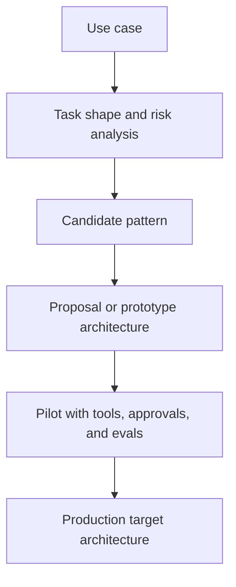

# Applied Agentic Architectures

Applied agentic architectures are concrete design artifacts that map a real use case into a candidate agent system, including goals, tools, control flow, approvals, and validation strategy.

> [!INFO] Core idea
> A proposal architecture is not the production system. It is a decision artifact that helps you test whether a pattern such as `ReAct`, planner-executor, or orchestrator-worker is a plausible fit before committing to full implementation.

## Why It Matters
Teams often jump directly from a use case to implementation. That skips the stage where you should decide whether the system needs a simple workflow, a bounded tool loop, a `ReAct`-style agent, or a more structured orchestration pattern. Applied architectures make those choices explicit and reviewable.

## Executive Lens
| Artifact | Best For | What It Should Prove | Main Failure |
| :--- | :--- | :--- | :--- |
| Concept sketch | first framing | why agentic design may be needed | too vague to test |
| Proposal architecture | client or internal alignment | whether the candidate pattern fits the use case | looks polished but hides missing constraints |
| Pilot architecture | pre-implementation validation | how tools, approvals, memory, and evals interact | ignores ops burden |
| Production target architecture | implementation guidance | what will actually be built and governed | locks design too early |

> [!IMPORTANT] Prototype architecture is not final architecture
> A `ReAct` proposal for an airline or another client use case can be a valid architecture probe even if the final system later moves to a bounded workflow, planner-executor, or human-gated design.

## Architecture Progression

> [!WARNING] A good-looking diagram can still be wrong
> If the architecture does not specify tools, memory boundaries, approvals, and exit conditions, it is still mostly illustration rather than design.

## Technical Core
### What A Concrete Architecture Should Specify
| Layer | Questions To Answer | Example For A `ReAct`-Style Proposal |
| :--- | :--- | :--- |
| Goal and user | what task is being delegated and for whom | resolve support or ops case with external context |
| Environment | where observations come from | CRM, policy docs, reservation APIs, email, dashboards |
| Tool layer | what can be read or written | read itinerary, search policy, draft response, escalate case |
| Control pattern | how next steps are chosen | thought, action, observation loop under limits |
| Memory and state | what persists across steps | case state, retrieved documents, prior actions |
| Harness and policy layer | what runtime carries the loop, how approvals fire, what isolation applies, and what reusable workflows exist | local CLI with worktrees and hooks, or cloud worker with persisted threads |
| Operational envelope | where it runs, what isolation applies, and how the review loop ends | local CLI sandbox, cloud task, or managed app flow with explicit handoff |
| Approval boundary | what needs human confirmation and at what authority level | drafts may be automated, refunds and rebookings require human sign-off |
| Validation | how success is checked | task completion rate, policy compliance, escalation quality |

### Decision Gates
| Stage | Must Demonstrate | Still Hypothetical | Frozen At This Stage |
| :--- | :--- | :--- | :--- |
| Proposal architecture | pattern fit, tool surfaces, approval points, and success criteria | real-world performance and failure rates | candidate control loop and interfaces |
| Pilot architecture | working tools, review loop, traces, and a small regression set | scale economics and broad autonomy | harness choice and validation shape |
| Production target architecture | reliable runs, rollback path, ownership, and monitoring | future optimizations or extra agents | operational envelope and control boundaries |

### Common Candidate Patterns
- `ReAct` when the environment or retrieved observations genuinely change the next step
- planner-executor when substeps are known enough to be made explicit
- router or specialist handoff when request classes diverge sharply
- orchestrator-worker when the work splits into truly independent roles or parallel exploration
- human-in-the-loop when operational or regulatory risk is high

### Validation Stack
| Layer | Use It For |
| :--- | :--- |
| Trace review | inspect flow failures and bad decisions on early runs |
| Small pilot dataset | iterate on prompts, tools, and approval boundaries quickly |
| Regression evals | block promotion from pilot to wider rollout |

### Design Workflow
| Stage | Main Question | Best Follow-On Note |
| :--- | :--- | :--- |
| architecture design | what is the minimum viable system shape? | [[Architecture Design Methods for Agent Systems]] |
| approval design | where must human judgment stay in control? | [[Human-in-the-Loop and Approval Flows]] |
| validation design | how will we know the architecture is actually good? | [[Validation and Eval Design for Agent Architectures]] |
| promotion design | what turns this from proposal into an operated system? | [[Proposal-to-Production for Agent Systems]] |

### Track Map
This track is not self-contained. It assumes the shared branch core has already covered `AI Agents`, `Agent Architectures and Orchestration Patterns`, and `Multi-Agent Systems`.

| Stage | Best Notes | Outcome |
| :--- | :--- | :--- |
| Core handoff | [[AI Agents]], [[Agent Architectures and Orchestration Patterns]], [[Multi-Agent Systems]] | shared trunk required before the specialization track |
| Apprenticeship | [[Applied Agentic Architectures]], [[Architecture Design Methods for Agent Systems]], [[Human-in-the-Loop and Approval Flows]] | design a sound proposal and reject unnecessary complexity |
| Advanced | [[Validation and Eval Design for Agent Architectures]], [[Proposal-to-Production for Agent Systems]], [[Orchestration Trade-offs and Pattern Selection]], [[Delegation and Role Specialization]] | move an architecture into pilot with real promotion criteria |
| Mastery | [[Reliability, Checkpoints, and Recovery in Agent Systems]], [[Computer Use and GUI Agents]], [[Applied Agentic Architecture Case Studies]], [[Agent Architectures and Orchestration Patterns]], [[Multi-Agent Systems]], [[Evaluation, Observability, and Governance for Agent Systems]] | review, govern, and evolve architectures in production |

### Subline Notes
- [[Architecture Design Methods for Agent Systems]]
- [[Human-in-the-Loop and Approval Flows]]
- [[Validation and Eval Design for Agent Architectures]]
- [[Proposal-to-Production for Agent Systems]]
- [[Orchestration Trade-offs and Pattern Selection]]
- [[Delegation and Role Specialization]]
- [[Reliability, Checkpoints, and Recovery in Agent Systems]]
- [[Computer Use and GUI Agents]]
- [[Applied Agentic Architecture Case Studies]]

> [!CAUTION] `ReAct` is a means, not the answer
> `ReAct` is useful when observation changes the next step, but it should not become the default architecture just because it is easy to sketch in a proposal.

## Design Patterns and Failure Modes
### Strong patterns
- begin with the smallest architecture that can express the task
- keep proposal architecture separate from production target architecture
- write down assumptions about tools, data freshness, and approval policy
- define what would cause the team to simplify or upgrade the design

### Failure modes
- using a prototype diagram as if it were implementation-ready
- hiding unresolved permissions or data-integration constraints
- treating memory as a vague box instead of a concrete state design
- selecting multi-agent or `ReAct` before the task shape is proven

> [!TIP] Practical default
> For proposal work, write the candidate architecture in layers: task, tools, harness, control loop, memory, approvals, and evals. Then explicitly label it as concept, pilot, or production target.

## Related Notes
- Prerequisites: [[When to Use Agentic Systems]], [[Agent Architectures and Orchestration Patterns]]
- Related: [[Economic and ROI Analysis for Agentic Systems]], [[AI Agents]], [[Architecture Design Methods for Agent Systems]], [[Proposal-to-Production for Agent Systems]], [[Validation and Eval Design for Agent Architectures]], [[Human-in-the-Loop and Approval Flows]], [[Orchestration Trade-offs and Pattern Selection]], [[Delegation and Role Specialization]], [[Reliability, Checkpoints, and Recovery in Agent Systems]], [[Computer Use and GUI Agents]], [[Applied Agentic Architecture Case Studies]], [[Planning and Control Flow in Agent Systems]], [[Tool Use and Environment Interaction]], [[Tool Ecosystems and Harness Engineering]], [[Software Engineering Agents]]

## Sources
- [ReAct: Synergizing Reasoning and Acting in Language Models (2022)](https://arxiv.org/abs/2210.03629)
- [A practical guide to building agents | OpenAI](https://openai.com/business/guides-and-resources/a-practical-guide-to-building-ai-agents/)
- [Building Effective AI Agents | Anthropic](https://www.anthropic.com/engineering/building-effective-agents)
- [Agent Builder | OpenAI](https://developers.openai.com/api/docs/guides/agent-builder)
- [Introducing the Codex app | OpenAI](https://openai.com/index/introducing-the-codex-app/)
- [How we built our multi-agent research system | Anthropic](https://www.anthropic.com/engineering/multi-agent-research-system)
- See [[Agentic Systems Sources and Research Log]]

## Last Reviewed
- 2026-04-18
