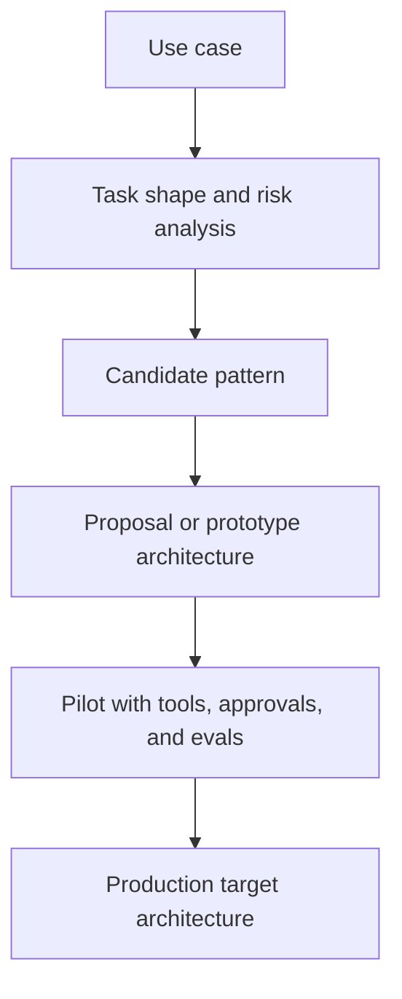

# Applied Agentic Architectures

Applied agentic architectures are concrete design artifacts that map a real use case into a candidate agent system, including goals, tools, control flow, approvals, and validation strategy.

> [!INFO] Core idea
> A proposal architecture is not the production system. It is a decision artifact that helps you test whether a pattern such as `ReAct`, planner-executor, or orchestrator-worker is a plausible fit before committing to full implementation.

## Why It Matters
Teams often jump directly from a use case to implementation. That skips the stage where you should decide whether the system needs a simple workflow, a bounded tool loop, a `ReAct`-style agent, a compiled knowledge system, or a more structured orchestration pattern. Applied architectures make those choices explicit and reviewable.

## Executive Lens
| Artifact | Best For | What It Should Prove | Main Failure |
| :--- | :--- | :--- | :--- |
| Concept sketch | first framing | why agentic design may be needed | too vague to test |
| Proposal architecture | client or internal alignment | whether the candidate pattern fits the use case | looks polished but hides missing constraints |
| Pilot architecture | pre-implementation validation | how tools, approvals, memory, and evals interact | ignores ops burden |
| Production target architecture | implementation guidance | what will actually be built and governed | locks design too early |

> [!IMPORTANT] Prototype architecture is not final architecture
> A `ReAct` proposal for an airline or another client use case can be a valid architecture probe even if the final system later moves to a bounded workflow, planner-executor, or human-gated design.

## Architecture Progression

> [!WARNING] A good-looking diagram can still be wrong
> If the architecture does not specify tools, memory boundaries, approvals, and exit conditions, it is still mostly illustration rather than design.

## Technical Core
### What A Concrete Architecture Should Specify
| Layer | Questions To Answer | Example For A `ReAct`-Style Proposal |
| :--- | :--- | :--- |
| Goal and user | what task is being delegated and for whom | resolve support or ops case with external context |
| Environment | where observations come from | CRM, policy docs, reservation APIs, email, dashboards |
| Tool layer | what can be read or written | read itinerary, search policy, draft response, escalate case |
| Control pattern | how next steps are chosen | thought, action, observation loop under limits |
| Memory and state | what persists across steps | case state, retrieved documents, prior actions |
| Harness and policy layer | what runtime carries the loop, how approvals fire, what isolation applies, and what reusable workflows exist | local CLI with worktrees and hooks, or cloud worker with persisted threads |
| Operational envelope | where it runs, what isolation applies, and how the review loop ends | local CLI sandbox, cloud task, or managed app flow with explicit handoff |
| Approval boundary | what needs human confirmation and at what authority level | drafts may be automated, refunds and rebookings require human sign-off |
| Validation | how success is checked | task completion rate, policy compliance, escalation quality |

### Decision Gates
| Stage | Must Demonstrate | Still Hypothetical | Frozen At This Stage |
| :--- | :--- | :--- | :--- |
| Proposal architecture | pattern fit, tool surfaces, approval points, and success criteria | real-world performance and failure rates | candidate control loop and interfaces |
| Pilot architecture | working tools, review loop, traces, and a small regression set | scale economics and broad autonomy | harness choice and validation shape |
| Production target architecture | reliable runs, rollback path, ownership, and monitoring | future optimizations or extra agents | operational envelope and control boundaries |

### Common Candidate Patterns
- `ReAct` when the environment or retrieved observations genuinely change the next step
- planner-executor when substeps are known enough to be made explicit
- router or specialist handoff when request classes diverge sharply
- orchestrator-worker when the work splits into truly independent roles or parallel exploration
- knowledge-compilation loops when the goal is a durable knowledge artifact such as a wiki, handbook, or editorial vault
- human-in-the-loop when operational or regulatory risk is high

### Validation Stack
| Layer | Use It For |
| :--- | :--- |
| Trace review | inspect flow failures and bad decisions on early runs |
| Small pilot dataset | iterate on prompts, tools, and approval boundaries quickly |
| Regression evals | block promotion from pilot to wider rollout |

### Design Workflow
| Stage | Main Question | Best Follow-On Note |
| :--- | :--- | :--- |
| architecture design | what is the minimum viable system shape? | [[020 Architecture Design Methods for Agent Systems\|Architecture Design Methods for Agent Systems]] |
| approval design | where must human judgment stay in control? | [[030 Human-in-the-Loop and Approval Flows\|Human-in-the-Loop and Approval Flows]] |
| validation design | how will we know the architecture is actually good? | [[040 Validation and Eval Design for Agent Architectures\|Validation and Eval Design for Agent Architectures]] |
| promotion design | what turns this from proposal into an operated system? | [[050 Proposal-to-Production for Agent Systems\|Proposal-to-Production for Agent Systems]] |
| knowledge-system design | how should durable notes, provenance, and review loops be structured? | [[085 Knowledge and Editorial Agents\|Knowledge and Editorial Agents]] |

### Core Handoff
This specialization is not self-contained. It assumes the shared branch core has already covered the agent loop, the tool and harness layer, architecture and orchestration patterns, and production-oriented evaluation.

| Shared Core Note | Why It Matters Before This Track |
| :--- | :--- |
| [[020 AI Agents\|AI Agents]] | defines what kind of system you are actually proposing |
| [[030 Tool Use and Environment Interaction\|Tool Use and Environment Interaction]] | makes tool boundaries, permissions, and environment shape explicit |
| [[050 Tool Ecosystems and Harness Engineering\|Tool Ecosystems and Harness Engineering]] | adds harness, session, approval, and isolation thinking to the design |
| [[080 Agent Architectures and Orchestration Patterns\|Agent Architectures and Orchestration Patterns]] | gives the candidate control patterns you are choosing between |
| [[100 Evaluation, Observability, and Governance for Agent Systems\|Evaluation, Observability, and Governance for Agent Systems]] | keeps pilot and production-target architectures tied to real validation and control |

### Track Map
This track builds on the core handoff notes above. Read those first, then use this specialization to turn real use cases into design artifacts, pilot criteria, and production-target architectures.

| Stage | Best Notes | Outcome |
| :--- | :--- | :--- |
| Core handoff | [[020 AI Agents\|AI Agents]], [[030 Tool Use and Environment Interaction\|Tool Use and Environment Interaction]], [[050 Tool Ecosystems and Harness Engineering\|Tool Ecosystems and Harness Engineering]], [[080 Agent Architectures and Orchestration Patterns\|Agent Architectures and Orchestration Patterns]], [[100 Evaluation, Observability, and Governance for Agent Systems\|Evaluation, Observability, and Governance for Agent Systems]] | shared trunk required before the specialization track |
| Apprenticeship | [[010 Applied Agentic Architectures\|Applied Agentic Architectures]], [[020 Architecture Design Methods for Agent Systems\|Architecture Design Methods for Agent Systems]], [[030 Human-in-the-Loop and Approval Flows\|Human-in-the-Loop and Approval Flows]] | design a sound proposal and reject unnecessary complexity |
| Advanced | [[040 Validation and Eval Design for Agent Architectures\|Validation and Eval Design for Agent Architectures]], [[050 Proposal-to-Production for Agent Systems\|Proposal-to-Production for Agent Systems]], [[060 Orchestration Trade-offs and Pattern Selection\|Orchestration Trade-offs and Pattern Selection]], [[065 Delegation and Role Specialization\|Delegation and Role Specialization]], [[085 Knowledge and Editorial Agents\|Knowledge and Editorial Agents]], [[090 LLM Wiki and Agentic Knowledge Bases\|LLM Wiki and Agentic Knowledge Bases]] | move an architecture into pilot, including compiled knowledge systems when the artifact itself is part of the value |
| Mastery | [[070 Reliability, Checkpoints, and Recovery in Agent Systems\|Reliability, Checkpoints, and Recovery in Agent Systems]], [[075 Computer Use and GUI Agents\|Computer Use and GUI Agents]], [[085 Knowledge and Editorial Agents\|Knowledge and Editorial Agents]], [[090 LLM Wiki and Agentic Knowledge Bases\|LLM Wiki and Agentic Knowledge Bases]], [[095 Editorial Review Loops for AI-Maintained Knowledge\|Editorial Review Loops for AI-Maintained Knowledge]], [[100 Applied Agentic Architecture Case Studies\|Applied Agentic Architecture Case Studies]], [[080 Agent Architectures and Orchestration Patterns\|Agent Architectures and Orchestration Patterns]], [[090 Multi-Agent Systems\|Multi-Agent Systems]], [[100 Evaluation, Observability, and Governance for Agent Systems\|Evaluation, Observability, and Governance for Agent Systems]] | review, govern, and evolve architectures in production, including knowledge-maintenance systems |

### Track Folder Map
| Folder | Role |
| :--- | :--- |
| `05 Agentic Systems/20 Applied Agentic Architectures` | specialization hub plus design, validation, approval, and production-hardening notes |

### Note Groups
| Group | Notes | Use It For |
| :--- | :--- | :--- |
| design and framing | [[020 Architecture Design Methods for Agent Systems\|Architecture Design Methods for Agent Systems]], [[060 Orchestration Trade-offs and Pattern Selection\|Orchestration Trade-offs and Pattern Selection]], [[065 Delegation and Role Specialization\|Delegation and Role Specialization]] | choosing the minimum viable architecture and role split |
| approvals and control | [[030 Human-in-the-Loop and Approval Flows\|Human-in-the-Loop and Approval Flows]], [[075 Computer Use and GUI Agents\|Computer Use and GUI Agents]] | deciding where human judgment, authority, and fragile surfaces stay gated |
| validation and promotion | [[040 Validation and Eval Design for Agent Architectures\|Validation and Eval Design for Agent Architectures]], [[050 Proposal-to-Production for Agent Systems\|Proposal-to-Production for Agent Systems]] | turning a proposal into a pilot with real promotion criteria |
| knowledge and editorial systems | [[085 Knowledge and Editorial Agents\|Knowledge and Editorial Agents]], [[090 LLM Wiki and Agentic Knowledge Bases\|LLM Wiki and Agentic Knowledge Bases]], [[095 Editorial Review Loops for AI-Maintained Knowledge\|Editorial Review Loops for AI-Maintained Knowledge]] | building compiled knowledge bases, editorial vaults, and reviewable memory layers |
| production hardening | [[070 Reliability, Checkpoints, and Recovery in Agent Systems\|Reliability, Checkpoints, and Recovery in Agent Systems]], [[100 Applied Agentic Architecture Case Studies\|Applied Agentic Architecture Case Studies]] | learning what a governed production-target architecture must survive |

> [!CAUTION] `ReAct` is a means, not the answer
> `ReAct` is useful when observation changes the next step, but it should not become the default architecture just because it is easy to sketch in a proposal.

## Design Patterns and Failure Modes
### Strong patterns
- begin with the smallest architecture that can express the task
- keep proposal architecture separate from production target architecture
- write down assumptions about tools, data freshness, and approval policy
- define what would cause the team to simplify or upgrade the design

### Failure modes
- using a prototype diagram as if it were implementation-ready
- hiding unresolved permissions or data-integration constraints
- treating memory as a vague box instead of a concrete state design
- selecting multi-agent or `ReAct` before the task shape is proven

> [!TIP] Practical default
> For proposal work, write the candidate architecture in layers: task, tools, harness, control loop, memory, approvals, and evals. Then explicitly label it as concept, pilot, or production target.

## Related Notes
- Prerequisites: [[020 AI Agents|AI Agents]], [[030 Tool Use and Environment Interaction|Tool Use and Environment Interaction]], [[050 Tool Ecosystems and Harness Engineering|Tool Ecosystems and Harness Engineering]], [[080 Agent Architectures and Orchestration Patterns|Agent Architectures and Orchestration Patterns]], [[100 Evaluation, Observability, and Governance for Agent Systems|Evaluation, Observability, and Governance for Agent Systems]]
- Related: [[015 Economic and ROI Analysis for Agentic Systems|Economic and ROI Analysis for Agentic Systems]], [[020 AI Agents|AI Agents]], [[020 Architecture Design Methods for Agent Systems|Architecture Design Methods for Agent Systems]], [[050 Proposal-to-Production for Agent Systems|Proposal-to-Production for Agent Systems]], [[040 Validation and Eval Design for Agent Architectures|Validation and Eval Design for Agent Architectures]], [[030 Human-in-the-Loop and Approval Flows|Human-in-the-Loop and Approval Flows]], [[060 Orchestration Trade-offs and Pattern Selection|Orchestration Trade-offs and Pattern Selection]], [[065 Delegation and Role Specialization|Delegation and Role Specialization]], [[070 Reliability, Checkpoints, and Recovery in Agent Systems|Reliability, Checkpoints, and Recovery in Agent Systems]], [[075 Computer Use and GUI Agents|Computer Use and GUI Agents]], [[085 Knowledge and Editorial Agents|Knowledge and Editorial Agents]], [[090 LLM Wiki and Agentic Knowledge Bases|LLM Wiki and Agentic Knowledge Bases]], [[095 Editorial Review Loops for AI-Maintained Knowledge|Editorial Review Loops for AI-Maintained Knowledge]], [[100 Applied Agentic Architecture Case Studies|Applied Agentic Architecture Case Studies]], [[060 Planning and Control Flow in Agent Systems|Planning and Control Flow in Agent Systems]], [[030 Tool Use and Environment Interaction|Tool Use and Environment Interaction]], [[050 Tool Ecosystems and Harness Engineering|Tool Ecosystems and Harness Engineering]], [[010 Software Engineering Agents|Software Engineering Agents]]

## Sources
- [ReAct: Synergizing Reasoning and Acting in Language Models (2022)](https://arxiv.org/abs/2210.03629)
- [A practical guide to building agents | OpenAI](https://openai.com/business/guides-and-resources/a-practical-guide-to-building-ai-agents/)
- [Building Effective AI Agents | Anthropic](https://www.anthropic.com/engineering/building-effective-agents)
- [Agent Builder | OpenAI](https://developers.openai.com/api/docs/guides/agent-builder)
- [Introducing the Codex app | OpenAI](https://openai.com/index/introducing-the-codex-app/)
- [How we built our multi-agent research system | Anthropic](https://www.anthropic.com/engineering/multi-agent-research-system)
- See [[010 Agentic Systems Sources and Research Log|Agentic Systems Sources and Research Log]]

## Last Reviewed
- 2026-04-20
