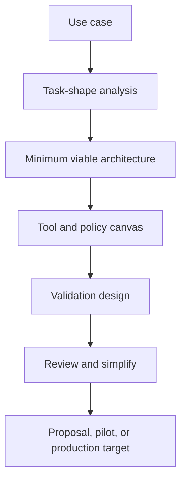

# Architecture Design Methods for Agent Systems

Architecture design methods for agent systems turn a fuzzy use case into a reviewable system proposal by forcing clarity on task shape, tool boundaries, control pattern, approvals, and evaluation before implementation begins.

> [!INFO] Core idea
> A good applied architecture does not start with “let’s use `ReAct`.” It starts with task shape, uncertainty, risk, and the minimum control structure needed to solve the work.

## Why It Matters
Teams often choose an architecture pattern too early and then justify it after the fact. That is how simple workflows become over-agentic and high-risk systems get under-specified. A method prevents architecture from becoming a pretty diagram with no operating discipline behind it.

## Design Workflow

> [!IMPORTANT] Simplicity is a design outcome
> The right first architecture is often smaller than the team expects. A method should make it easier to reject unnecessary loops, memory, or delegation.

## Architecture Canvas
| Layer | Questions To Force | Example Output |
| :--- | :--- | :--- |
| task | what exactly must be achieved and for whom? | support-case resolution with bounded actions |
| uncertainty | where does the next step genuinely depend on observation? | policy docs and ticket context change the next action |
| tool surface | what can be read, written, or triggered? | read CRM, draft response, escalate case |
| control pattern | workflow, bounded loop, planner, router, worker? | bounded tool loop with escalation |
| memory | what state must persist and for how long? | case timeline and retrieved snippets |
| policy | what always needs approval or must be impossible? | refunds require human sign-off |
| evals | how will the design be judged before rollout? | pilot set plus trace grading |

## Task-Shape Heuristics
| Signal | Usually Pushes Toward |
| :--- | :--- |
| steps are known and stable | workflow or planner-executor |
| observations change the next move | bounded loop or `ReAct`-style pattern |
| request classes differ sharply | router or specialist handoff |
| work naturally splits into independent roles | orchestrator-worker |
| action cost or risk is high | human-gated pattern |

### Design Review Checklist
- can the system be simplified to a workflow?
- is each tool tied to a concrete business or engineering action?
- are approval boundaries explicit, not implied?
- is memory real state or just a vague future box?
- do the evals test the architecture, not only the model?

> [!WARNING] “Agentic” is not a design requirement
> If a workflow with typed steps solves the task, adding open-ended agent loops often increases cost and failure surface without adding value.

## Minimum Viable Architecture
| Level | What It Should Contain | What It Should Exclude |
| :--- | :--- | :--- |
| first proposal | task, tools, control loop, approvals, success criteria | speculative optimization and extra agents |
| pilot design | working harness, traces, pilot evals, operator review path | broad autonomy and scale assumptions |
| production target | ownership, rollback, monitoring, promotion gates | unresolved policy or environment questions |

> [!TIP] Practical default
> Draft the smallest architecture that can fail meaningfully in a pilot. That gives you signal quickly without locking in unnecessary complexity.

## Failure Modes
- picking the pattern before studying the task shape
- drawing memory or multi-agent boxes with no concrete state design
- forgetting approval and rollback because the diagram “is only conceptual”
- using a model choice as a substitute for control architecture
- treating evaluation as something to add after implementation

## Related Notes
- Prerequisites: [[010 Applied Agentic Architectures|Applied Agentic Architectures]], [[080 Agent Architectures and Orchestration Patterns|Agent Architectures and Orchestration Patterns]]
- Related: [[050 Proposal-to-Production for Agent Systems|Proposal-to-Production for Agent Systems]], [[040 Validation and Eval Design for Agent Architectures|Validation and Eval Design for Agent Architectures]], [[030 Human-in-the-Loop and Approval Flows|Human-in-the-Loop and Approval Flows]]

## Sources
- [A practical guide to building agents | OpenAI](https://openai.com/business/guides-and-resources/a-practical-guide-to-building-ai-agents/)
- [Building Effective AI Agents | Anthropic](https://www.anthropic.com/engineering/building-effective-agents)
- [Agent Builder | OpenAI API](https://platform.openai.com/docs/guides/agent-builder)
- [ReAct: Synergizing Reasoning and Acting in Language Models (2022)](https://arxiv.org/abs/2210.03629)
- [MRKL Systems (2022)](https://arxiv.org/abs/2205.00445)
- See [[010 Agentic Systems Sources and Research Log|Agentic Systems Sources and Research Log]]

## Last Reviewed
- 2026-04-18
