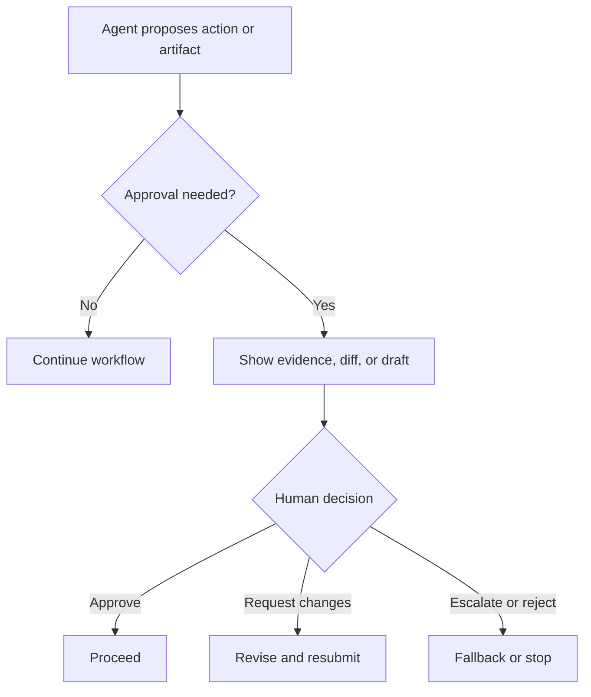

# Human-in-the-Loop and Approval Flows

Human-in-the-loop design defines where a person must review, approve, redirect, or override the agent, and how that intervention changes the control flow of the system.

> [!INFO] Core idea
> Human review is not a vague safety blanket. It is a designed control surface with specific authority boundaries, latency costs, and consequences for the rest of the architecture.

## Why It Matters
Many agent systems say “a human will approve” without specifying what is being approved, what evidence the human sees, how escalation works, or what happens if the human disagrees. That is not a real approval flow; it is a missing part of the architecture.

## Approval Flow Map

> [!IMPORTANT] Approval is a product decision
> The agent, the UI, the artifact format, and the escalation rule all shape whether human approval is fast, informed, and reliable.

## Approval Design Dimensions
| Dimension | Questions To Answer |
| :--- | :--- |
| scope | what exact action or artifact is being approved? |
| authority | who may approve it? |
| evidence | what trace, draft, diff, or rationale must be shown? |
| reversibility | can the action be undone later? |
| latency tolerance | how long may the system wait for approval? |
| fallback | what happens if approval is denied or absent? |

## Common Approval Patterns
| Pattern | Best For | Main Tradeoff |
| :--- | :--- | :--- |
| draft review | text or code artifacts before publication | adds reviewer effort but preserves quality |
| action confirmation | tool calls with external side effects | safer but slower |
| supervisor checkpoint | long-running flows or multi-agent work | stronger control with more context switching |
| escalation gate | ambiguous, risky, or policy-sensitive cases | reduces harm but may feel conservative |

### Good Reviewer Experience
| Reviewer Need | Good System Response |
| :--- | :--- |
| understand quickly | concise summary plus highlighted evidence |
| inspect the actual change | diff, draft, or action payload |
| see uncertainty | explicit assumptions and unresolved questions |
| redirect the work | approve with edits, request revision, or escalate |

> [!WARNING] Poor approval UX creates fake safety
> If the reviewer sees only a vague prompt or a wall of logs, approval becomes rubber-stamping. The system technically has a human in the loop, but not meaningful human control.

## Design Rules
- gate irreversible or high-impact actions more tightly than reversible drafts
- show the minimum evidence needed for an informed decision
- treat human latency as part of the system cost model
- define what the agent should do after rejection or silence
- log approvals and rejections as first-class trace events

## Failure Modes
- approval gates with no visible evidence
- using the same reviewer path for low-risk and high-risk actions
- escalating too often because the base policy is under-specified
- letting the agent continue after a denied action without redesigning the plan
- treating approval as a generic checkbox instead of a domain-specific control point

> [!TIP] Practical default
> Put humans in the loop at the action boundary that matters most: external writes, irreversible operations, or outputs that affect customers, codebases, or production systems.

## Related Notes
- Prerequisites: [[Applied Agentic Architectures]], [[Approvals, Permissions, and Sandboxing for Coding Agents]]
- Related: [[Proposal-to-Production for Agent Systems]], [[Validation and Eval Design for Agent Architectures]], [[Evaluation, Observability, and Governance for Agent Systems]]

## Sources
- [Safety in building agents | OpenAI API](https://platform.openai.com/docs/guides/agent-builder-safety)
- [A practical guide to building agents | OpenAI](https://openai.com/business/guides-and-resources/a-practical-guide-to-building-ai-agents/)
- [Building Effective AI Agents | Anthropic](https://www.anthropic.com/engineering/building-effective-agents)
- [How we built our multi-agent research system | Anthropic](https://www.anthropic.com/engineering/multi-agent-research-system)
- See [[Agentic Systems Sources and Research Log]]

## Last Reviewed
- 2026-04-18
