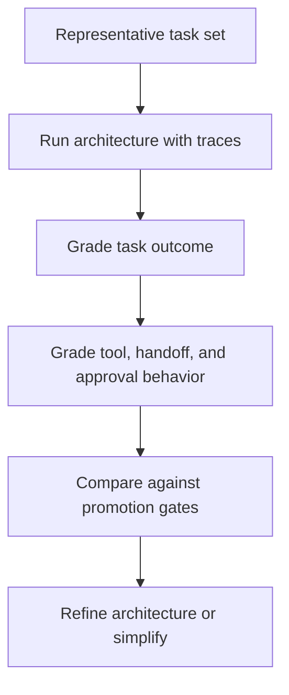

# Validation and Eval Design for Agent Architectures

Validation and eval design for agent architectures focuses on whether the system shape itself is right, not only whether the underlying model can produce a plausible answer.

> [!INFO] Core idea
> Architecture evals should test loops, handoffs, approvals, tools, and failure handling. If you evaluate only the final answer, you often miss the architectural reason the run succeeded or failed.

## Why It Matters
Two agent systems can use the same model and differ radically in reliability because their architecture differs. A planner can over-plan, a router can misclassify, a worker graph can lose accountability, and a human approval node can create hidden latency or silent bypasses. The eval design has to expose those failures.

## Validation Stack

> [!IMPORTANT] Evaluate the architecture, not just the model
> If the architecture changes from bounded workflow to planner-executor or to orchestrator-worker, the eval should change too. Otherwise you are measuring the wrong thing.

## What To Grade
| Architectural Element | What To Look For |
| :--- | :--- |
| tool use | wrong tool, malformed input, unsafe write, missing retry discipline |
| control loop | premature stop, infinite loop, stale plan, weak replanning |
| routing | correct specialist chosen, avoidable handoff, misclassification |
| worker coordination | duplicated work, conflicting outputs, unclear ownership |
| approval flow | correct escalation, no skipped gate, no unnecessary pauses |
| memory use | useful persisted state versus stale or harmful carryover |

## Eval Types By Architecture
| Architecture Shape | Eval Focus |
| :--- | :--- |
| workflow | step correctness and typed handoff quality |
| bounded agent loop | stop conditions, retries, and tool discipline |
| planner-executor | plan usefulness, execution fidelity, replan triggers |
| router | routing accuracy and fallback path |
| orchestrator-worker | worker isolation, aggregation quality, coordination overhead |
| human-gated system | approval quality, latency cost, and escalation correctness |

### Pilot Dataset Design
- include straightforward cases that should succeed cleanly
- include ambiguous cases that should trigger escalation
- include cases where tools return misleading or partial information
- include cases where the best response is to stop or downgrade the architecture
- include adversarial or policy-sensitive cases when risk is meaningful

### Pilot Recipe
| Step | Why It Exists |
| :--- | :--- |
| representative pilot set | reflects the real task classes the architecture claims to solve |
| simpler baseline | tests whether extra orchestration is actually justified |
| architecture-specific grading | catches loop, handoff, and approval failures |
| promotion threshold | determines widen, redesign, or stop |

> [!WARNING] Final-answer scoring hides architecture failures
> A system can arrive at a correct output after a dangerous tool call, unnecessary worker explosion, or skipped approval. That is a successful answer and a failed architecture.

## Promotion Gates
| Stage | Minimum Eval Discipline |
| :--- | :--- |
| proposal | structured design review and scenario walk-through |
| pilot | trace review, small dataset, and architecture-specific grading |
| limited production | regression suite, approval-path checks, and rollback criteria |
| scaled production | continuous refresh, drift review, and incident-linked eval updates |

## Failure Modes
- using one generic score for every architecture pattern
- grading only success rate without trace review
- evaluating easy cases but not ambiguous or high-risk ones
- failing to grade approval and handoff behavior
- promoting a more complex architecture without a counterfactual simpler baseline

> [!TIP] Practical default
> Before scaling an architecture, compare it against a simpler baseline on the same task set. If the extra planning, routing, or delegation does not produce better traces or outcomes, remove it.

## Related Notes
- Prerequisites: [[Applied Agentic Architectures]], [[Evaluation, Observability, and Governance for Agent Systems]]
- Related: [[Architecture Design Methods for Agent Systems]], [[Proposal-to-Production for Agent Systems]], [[Evaluating Software Engineering Agents]], [[Reliability, Checkpoints, and Recovery in Agent Systems]]

## Sources
- [Trace grading | OpenAI API](https://platform.openai.com/docs/guides/trace-grading)
- [Demystifying evals for AI agents | Anthropic](https://www.anthropic.com/engineering/demystifying-evals-for-ai-agents)
- [Survey on Evaluation of LLM-based Agents (2025)](https://arxiv.org/abs/2503.16416)
- [A practical guide to building agents | OpenAI](https://openai.com/business/guides-and-resources/a-practical-guide-to-building-ai-agents/)
- [Building Effective AI Agents | Anthropic](https://www.anthropic.com/engineering/building-effective-agents)
- See [[Agentic Systems Sources and Research Log]]

## Last Reviewed
- 2026-04-18
