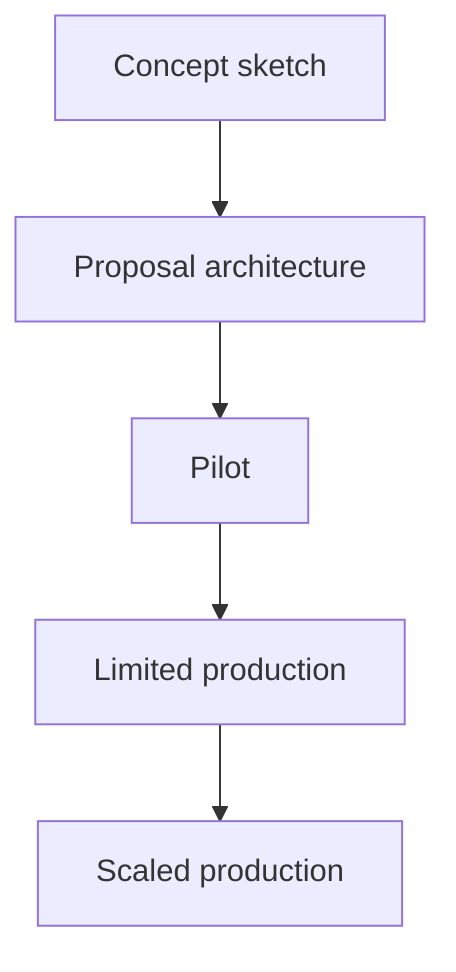

# Proposal-to-Production for Agent Systems

Proposal-to-production is the discipline of moving an agent system through explicit maturity stages, each with its own evidence, limits, owners, and promotion criteria.

> [!INFO] Core idea
> A proposal is a design claim. A production system is an operated service. The path between them needs pilot criteria, rollout policy, rollback design, and ownership, not just stronger prompts.

## Why It Matters
Many teams can sketch an agent architecture. Far fewer can promote it safely. Without staged promotion, the team ends up treating a polished prototype as a deployable system or, worse, deploying something that lacks auditability, fallback, and incident discipline.

## Maturity Path

> [!IMPORTANT] Promotion should require evidence
> Moving from one stage to the next should depend on validation, not enthusiasm. If the team cannot state the exit criteria, the stage boundary is not real.

## Stage Table
| Stage | Goal | Must Be True Before Promotion |
| :--- | :--- | :--- |
| concept sketch | frame the opportunity | task shape and candidate pattern are coherent |
| proposal architecture | align on design | tools, approvals, success criteria, and risks are explicit |
| pilot | test with real traces | working harness, pilot dataset, and visible failure modes |
| limited production | prove controlled value | owner, rollback path, monitoring, and narrow rollout scope |
| scaled production | operate reliably | ongoing eval refresh, incident loop, and governance fit |

## Operational Readiness Checklist
| Area | What Must Exist |
| :--- | :--- |
| ownership | a team or person responsible for quality and incidents |
| approval policy | who can authorize which actions |
| rollback | how to disable, revert, or narrow the system |
| observability | traces, logs, and promotion metrics |
| fallback path | what humans do when the agent stops or is denied |
| change management | how prompts, tools, and models are versioned |

### Operating Boundaries
| Boundary | What Must Be Explicit |
| :--- | :--- |
| owner | who owns quality, policy, and incident response |
| rollout slice | which users, repos, queues, or tasks are in scope |
| rollback | how the system is disabled, reverted, or narrowed |
| incident path | who investigates, pauses, and recovers failures |

### Rollout Patterns
| Pattern | Use It When | Main Tradeoff |
| :--- | :--- | :--- |
| shadow mode | you want traces before real actions | no direct user value yet |
| human-drafted, agent-assisted | output risk is moderate but still review-heavy | slower throughput |
| narrow production slice | one queue, repo, team, or issue class is ready | partial operational complexity |
| broader delegation | pilot evidence and review loop are already stable | larger failure surface |

> [!WARNING] Production is an operating model
> If there is no owner, no rollback, and no incident path, the system is not in production maturity even if users can click it.

## “Do Not Deploy Yet” Signals
- the team cannot explain what the agent should refuse
- evals exist only as anecdotes or demos
- the fallback path is “a human will figure it out”
- approval boundaries depend on convention instead of runtime policy
- model, tool, or prompt changes are not versioned

## Promotion Questions
| Question | Why It Matters |
| :--- | :--- |
| what evidence justifies the next stage? | stops premature rollout |
| what new failure class appears at this stage? | forces stage-specific risk thinking |
| who can pause or roll back the system? | clarifies real accountability |
| how narrow is the rollout slice? | keeps blast radius controllable |
| what will trigger de-scope or redesign? | prevents sunk-cost escalation |

> [!TIP] Practical default
> Treat pilot as the decisive stage. If the pilot cannot produce clean traces, clear promotion metrics, and a credible fallback path, do not widen the rollout.

## Failure Modes
- skipping from proposal to broad rollout
- calling a human-reviewed prototype “production”
- measuring activity instead of usefulness and safety
- widening scope without changing monitoring and approval design
- lacking a rollback path once the agent touches external systems

## Related Notes
- Prerequisites: [[010 Applied Agentic Architectures|Applied Agentic Architectures]], [[100 Evaluation, Observability, and Governance for Agent Systems|Evaluation, Observability, and Governance for Agent Systems]]
- Related: [[020 Architecture Design Methods for Agent Systems|Architecture Design Methods for Agent Systems]], [[040 Validation and Eval Design for Agent Architectures|Validation and Eval Design for Agent Architectures]], [[030 Human-in-the-Loop and Approval Flows|Human-in-the-Loop and Approval Flows]], [[070 Reliability, Checkpoints, and Recovery in Agent Systems|Reliability, Checkpoints, and Recovery in Agent Systems]]

## Sources
- [A practical guide to building agents | OpenAI](https://openai.com/business/guides-and-resources/a-practical-guide-to-building-ai-agents/)
- [Agent Builder | OpenAI API](https://platform.openai.com/docs/guides/agent-builder)
- [Background mode | OpenAI API](https://platform.openai.com/docs/guides/background)
- [Safety in building agents | OpenAI API](https://platform.openai.com/docs/guides/agent-builder-safety)
- [Building Effective AI Agents | Anthropic](https://www.anthropic.com/engineering/building-effective-agents)
- [How we built our multi-agent research system | Anthropic](https://www.anthropic.com/engineering/multi-agent-research-system)
- See [[010 Agentic Systems Sources and Research Log|Agentic Systems Sources and Research Log]]

## Last Reviewed
- 2026-04-18
