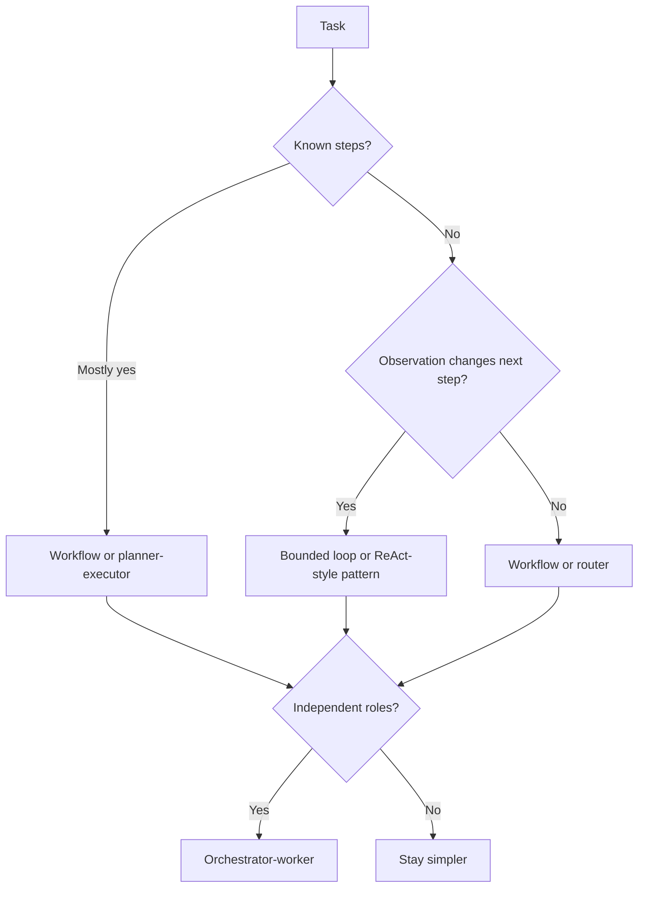

# Orchestration Trade-offs and Pattern Selection

Orchestration trade-offs and pattern selection focus on choosing the simplest agent structure that fits the task, rather than choosing the most impressive-looking one.

> [!INFO] Core idea
> Architecture patterns are not interchangeable. The right choice depends on uncertainty, task decomposition, approval cost, observability, and the penalties of coordination overhead.

## Why It Matters
Most applied systems do not fail because the team forgot a pattern name. They fail because the team chose more orchestration than the task needed or less control than the risk required. Pattern selection is therefore a trade-off exercise, not a taxonomy quiz.

## Pattern Choice Map

> [!IMPORTANT] Complexity must earn its keep
> Every planner, router, worker, or approval node adds coordination cost. If the extra structure does not improve outcomes or governance, it should be removed.

## Pattern Comparison
| Pattern | Best When | Main Strength | Main Cost |
| :--- | :--- | :--- | :--- |
| workflow | steps are stable and typed | predictability and auditability | weak adaptation |
| bounded agent loop | next move depends on observation | flexible tool use | harder stop logic |
| planner-executor | dependent multi-step work benefits from explicit plan | better reviewability than free-form loops | stale or over-detailed plans |
| router | request classes diverge clearly | specialized handling | routing errors and fallback gaps |
| orchestrator-worker | roles split into parallel or specialized work | scalable decomposition | coordination overhead |
| human-gated system | action cost or regulatory risk is high | strong trust boundary | latency and handoff cost |

### Hybrid Patterns
| Hybrid | Use It For | Main Watchout |
| :--- | :--- | :--- |
| router plus bounded loop | heterogeneous tasks where each route still needs adaptation | routing may become the hidden failure point |
| planner plus bounded executor | plans need structure but local recovery still matters | two layers may disagree on stop conditions |
| orchestrator plus human-gate | multi-role work with high approval sensitivity | human review can become the throughput bottleneck |

> [!WARNING] Pattern names can hide the real failure
> Teams often say “we need multi-agent” when the real need is better validation, clearer approvals, or a narrower workflow. That leads to expensive structure solving the wrong problem.

## Pattern Selection Questions
- what is the minimum structure that can solve the task?
- where does the next step actually depend on observation?
- what is the coordination cost of adding one more worker or reviewer?
- what simpler baseline should this pattern beat?
- what failure mode becomes more likely after adding this layer?

## Failure Modes
- using workers where one bounded agent would suffice
- adding a planner when typed workflow steps are already clear
- routing without a robust fallback path
- choosing ReAct because it demos well rather than because observation really changes the next move
- ignoring the observability cost of more nodes and handoffs

> [!TIP] Practical default
> Compare every new architecture candidate against a simpler baseline on the same task. If the extra orchestration does not improve either results or control, simplify.

## Related Notes
- Prerequisites: [[080 Agent Architectures and Orchestration Patterns|Agent Architectures and Orchestration Patterns]], [[010 Applied Agentic Architectures|Applied Agentic Architectures]]
- Related: [[020 Architecture Design Methods for Agent Systems|Architecture Design Methods for Agent Systems]], [[040 Validation and Eval Design for Agent Architectures|Validation and Eval Design for Agent Architectures]], [[090 Multi-Agent Systems|Multi-Agent Systems]]

## Sources
- [Building Effective AI Agents | Anthropic](https://www.anthropic.com/engineering/building-effective-agents)
- [A practical guide to building agents | OpenAI](https://openai.com/business/guides-and-resources/a-practical-guide-to-building-ai-agents/)
- [How we built our multi-agent research system | Anthropic](https://www.anthropic.com/engineering/multi-agent-research-system)
- [MRKL Systems (2022)](https://arxiv.org/abs/2205.00445)
- [ReAct: Synergizing Reasoning and Acting in Language Models (2022)](https://arxiv.org/abs/2210.03629)
- See [[010 Agentic Systems Sources and Research Log|Agentic Systems Sources and Research Log]]

## Last Reviewed
- 2026-04-18
