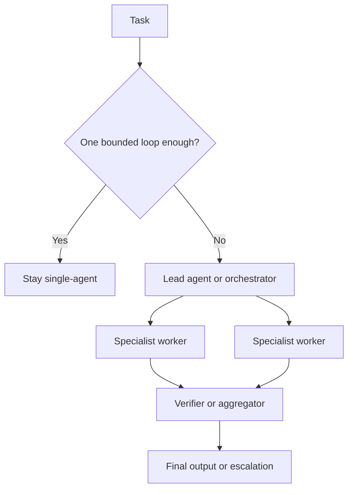

# Delegation and Role Specialization

Delegation and role specialization define when a task should stay inside one agent loop and when it should be split across multiple agents, workers, or reviewers with explicit responsibilities.

> [!INFO] Core idea
> Delegation is not the act of creating more agents. It is the act of assigning clearer boundaries, outputs, and responsibilities than one loop can reliably manage alone.

## Why It Matters
Most multi-agent failures come from weak delegation rather than weak models. If role boundaries are vague, agents duplicate work, miss gaps, or pass low-quality context between each other. Good delegation turns coordination into a design decision rather than a prompt trick.

## Delegation Map

## Role Pattern Comparison
| Pattern | Best For | Main Strength | Main Failure |
| :--- | :--- | :--- | :--- |
| manager as tools | one lead agent should keep control of user interaction | central coordination and clear aggregation | manager overload |
| handoff between peers | sharp transitions between domains or authority levels | clean domain ownership | brittle transfer points |
| planner plus executor | dependent work that benefits from explicit task framing | more reviewable than free-form delegation | stale or over-detailed plans |
| solver plus verifier | quality control or policy checking | separates generation from checking | verifier becomes rubber stamp |
| parallel specialists | breadth-first exploration or independent subtasks | speed and coverage | duplicated searches and context drift |

> [!IMPORTANT] Delegation needs a contract
> Every delegated task should specify objective, output format, tool scope, stopping rule, and what is explicitly out of scope.

## Handoff Contract
| Contract Field | Why It Matters |
| :--- | :--- |
| objective | tells the worker what problem it owns |
| output shape | reduces ambiguous results and aggregation friction |
| tool and source guidance | narrows the search space and prevents wrong-tool drift |
| context boundary | prevents each worker from inheriting unnecessary noise |
| stop rule | avoids endless searching or refinement |
| escalation condition | defines when the worker should return uncertainty instead of improvising |

### Shared Vs Local Context
| Context Model | Use When | Main Risk |
| :--- | :--- | :--- |
| mostly shared context | workers need common state or strict consistency | bloated prompts and cross-talk |
| role-local context with summaries | tasks decompose cleanly into subproblems | lost nuance during handoff |
| artifact-based coordination | outputs can persist independently as files, reports, or structured records | stale artifacts if ownership is unclear |

> [!WARNING] Role sprawl destroys the point of specialization
> If the team cannot explain why each role exists and what unique failure it prevents, the architecture is probably over-delegated.

## When Delegation Pays Off
- breadth-first search or research where multiple directions can be explored in parallel
- workflows where verification should be independent from generation
- environments where tool catalogs or policies differ strongly by subtask
- tasks that exceed one context window or one clean mental frame

## When Delegation Usually Does Not Pay Off
- small linear tasks with one main tool path
- coding tasks where most work happens in one tightly coupled repo context
- systems where all agents need the same large context all the time
- use cases where coordination latency is more expensive than extra reasoning in one loop

> [!CAUTION] Parallelism is not free capacity
> More workers can improve coverage, but they also multiply tokens, synchronization cost, and the need for good aggregation logic.

## Failure Modes
- vague worker briefs that cause duplicate effort
- overlapping tool access with no clear ownership
- weak aggregation that accepts inconsistent or partial outputs
- too many workers for simple tasks
- delegating uncertainty without defining how disagreement is resolved

> [!TIP] Practical default
> Start with one lead agent and one specialist or verifier. Only add more roles after evals show that the extra role removes a specific failure mode or meaningfully improves throughput.

## Related Notes
- Prerequisites: [[090 Multi-Agent Systems|Multi-Agent Systems]], [[060 Orchestration Trade-offs and Pattern Selection|Orchestration Trade-offs and Pattern Selection]]
- Related: [[010 Applied Agentic Architectures|Applied Agentic Architectures]], [[080 Agent Architectures and Orchestration Patterns|Agent Architectures and Orchestration Patterns]], [[030 Human-in-the-Loop and Approval Flows|Human-in-the-Loop and Approval Flows]], [[100 Applied Agentic Architecture Case Studies|Applied Agentic Architecture Case Studies]], [[050 Tool Ecosystems and Harness Engineering|Tool Ecosystems and Harness Engineering]]

## Sources
- [A practical guide to building agents | OpenAI](https://openai.com/business/guides-and-resources/a-practical-guide-to-building-ai-agents/)
- [Building Effective AI Agents | Anthropic](https://www.anthropic.com/engineering/building-effective-agents)
- [How we built our multi-agent research system | Anthropic](https://www.anthropic.com/engineering/multi-agent-research-system)
- [Create custom subagents | Claude Code docs](https://code.claude.com/docs/en/sub-agents)
- [Large Language Model based Multi-Agents: A Survey of Progress and Challenges (2024)](https://arxiv.org/abs/2402.01680)
- See [[010 Agentic Systems Sources and Research Log|Agentic Systems Sources and Research Log]]

## Last Reviewed
- 2026-04-18
