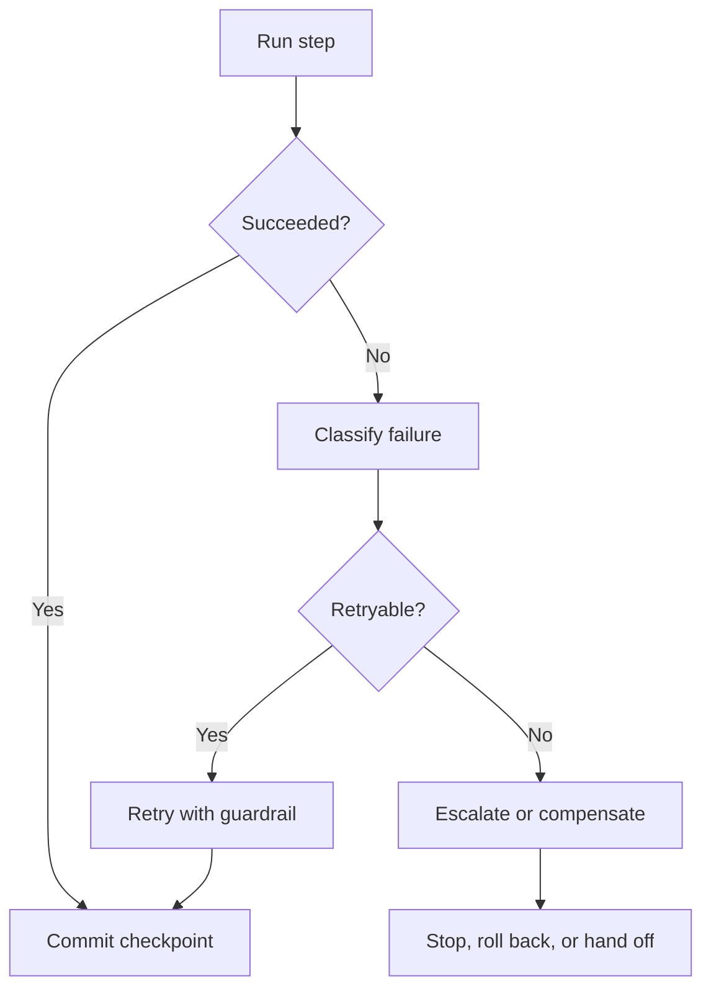

# Reliability, Checkpoints, and Recovery in Agent Systems

Reliability, checkpoints, and recovery define how an agent system survives interruptions, retries, partial failures, and stale state without producing unsafe or confusing outcomes.

> [!INFO] Core idea
> Reliable agent systems do not assume each run completes cleanly. They are built to pause, resume, retry, roll back, or stop safely when the environment turns messy.

## Why It Matters
As soon as agents run longer than a single interaction or depend on external tools, failures become normal: network drift, stale data, human latency, duplicate actions, and half-complete writes. Checkpoints and recovery logic are what stop those failures from becoming silent corruption.

## Recovery Loop

> [!IMPORTANT] Retries need policy
> A blind retry loop is not reliability. Reliable systems define which failures are retryable, how many attempts are acceptable, and when to escalate instead.

## Reliability Layers
| Layer | What It Protects | Example |
| :--- | :--- | :--- |
| checkpointing | continuity across interruption | save task state before waiting on CI |
| idempotency | repeated actions without duplicate side effects | safe rerun of a classification step |
| compensation | recovery after partial external writes | revert draft or disable partial rollout |
| timeout policy | work that should stop rather than linger | cancel hung tool call after threshold |
| escalation path | failures the agent should not resolve alone | human review after repeated auth failures |

## Failure Classification
| Failure Type | Preferred Response | Main Risk |
| :--- | :--- | :--- |
| transient tool failure | bounded retry | retry storm |
| stale context or state drift | re-read or revalidate | continuing from obsolete assumptions |
| permission denial | escalate or redesign plan | unsafe workaround |
| partial external side effect | compensate or stop | inconsistent system state |
| unknown failure | stop with artifacts and summary | silent corruption |

### Checkpoint Design Questions
- what state is expensive or dangerous to reconstruct?
- which actions must be idempotent before retries are allowed?
- which failures should never auto-retry?
- what artifact tells a human how to resume or recover?
- what is the cleanup rule for abandoned tasks?

> [!WARNING] Recovery is part of the architecture, not only operations
> If rollback, idempotency, and stale-state handling are missing from the design, the architecture is incomplete even if the happy path looks convincing.

## Design Rules
- checkpoint before long waits and risky transitions
- separate retryable from non-retryable failures explicitly
- preserve enough artifact context for human recovery
- design compensating actions for partial writes when possible
- choose stop rules that prefer safe interruption over ambiguous continuation

## Failure Modes
- infinite retry loops on non-retryable failures
- resuming after environment drift without revalidation
- duplicate side effects because the system lacks idempotency
- no clear owner or artifact when a background task dies
- treating rollback as “someone can manually fix it later”

> [!TIP] Practical default
> The first recovery capability to add is not a fancy retry policy. It is a checkpoint plus a clean human-readable recovery artifact.

## Related Notes
- Prerequisites: [[Proposal-to-Production for Agent Systems]], [[Validation and Eval Design for Agent Architectures]]
- Related: [[Long-Running and Background Coding Agents]], [[Human-in-the-Loop and Approval Flows]], [[Evaluation, Observability, and Governance for Agent Systems]]

## Sources
- [Background mode | OpenAI API](https://platform.openai.com/docs/guides/background)
- [Effective harnesses for long-running agents | Anthropic](https://www.anthropic.com/engineering/effective-harnesses-for-long-running-agents)
- [Managed Agents | Anthropic](https://www.anthropic.com/engineering/managed-agents)
- [Demystifying evals for AI agents | Anthropic](https://www.anthropic.com/engineering/demystifying-evals-for-ai-agents)
- [A practical guide to building agents | OpenAI](https://openai.com/business/guides-and-resources/a-practical-guide-to-building-ai-agents/)
- See [[Agentic Systems Sources and Research Log]]

## Last Reviewed
- 2026-04-18
