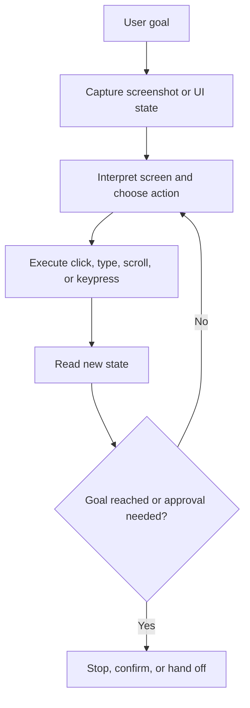

# Computer Use and GUI Agents

Computer use and GUI agents are agent systems that operate through screenshots and interface actions such as clicks, typing, scrolling, and keypresses when no robust API-first path is available.

> [!INFO] Core idea
> GUI agents extend tool use into environments designed for humans rather than for clean machine interfaces, which makes them flexible but also much more fragile.

## Why It Matters
Many valuable systems still live behind browsers, legacy desktops, admin consoles, or multi-step forms. Computer-use models make those surfaces accessible without bespoke APIs, but they also inherit the messiness of pixels, layout drift, prompt injection, and irreversible UI actions. This area is best treated as `current practice + emerging`, not as a default production surface.

## API-First Vs GUI-First
| Choice | Best When | Main Benefit | Main Risk |
| :--- | :--- | :--- | :--- |
| API-first | the target system already exposes stable programmatic actions | stronger reliability, lower latency, clearer permissions | integration work may still be non-trivial |
| GUI-first | no useful API exists or the UI spans many systems with human-only workflows | broader reach without custom integration per surface | higher fragility, latency, and safety burden |
| hybrid | APIs cover core writes while GUI fills last-mile gaps | keeps critical actions typed and auditable | mixed architecture can become hard to govern |

> [!IMPORTANT] GUI should usually be the fallback, not the first choice
> If an API can safely express the same action, it is usually the better production interface.

## Observe Decide Act Loop

## Environment And Risk Profile
| Risk Layer | Why It Is Harder In GUI Agents | Mitigation Direction |
| :--- | :--- | :--- |
| perception | the model reasons from screenshots rather than typed schemas | constrained displays, repeated screenshots, UI normalization |
| action accuracy | clicks and typing can hit the wrong target | bounded environments, validation after each action |
| prompt injection | webpages and screens can contain hostile instructions | sandboxing, allowlists, confirmation gates, trusted environments |
| side effects | UI actions may be irreversible or expensive | human approval for meaningful real-world consequences |
| recovery | state can drift when screens change, modals appear, or sessions expire | checkpoints, recovery logic, and explicit rereads |

> [!WARNING] Computer use is a higher-risk surface
> Both OpenAI and Anthropic position computer use as beta or preview functionality and warn against trusting it blindly in sensitive or fully authenticated environments.

## When GUI Agents Are Justified
- the system has no stable API or integration path
- the workflow spans multiple human-facing tools that would be expensive to integrate one by one
- the task can tolerate latency and occasional recovery loops
- approval boundaries can be enforced before high-impact actions

## When GUI Agents Are Usually a Bad Fit
- high-stakes financial, legal, or safety-critical actions without close human oversight
- environments with abundant typed APIs already available
- workflows where speed and determinism matter more than reach
- systems that expose sensitive credentials or broad privileged access

> [!CAUTION] Safety and operations dominate faster here
> In GUI agents, the limiting factor is often not model intelligence but environment isolation, approval policy, recovery design, and evaluation quality.

## Evaluation Strategy
| Eval Layer | Use It For |
| :--- | :--- |
| sandbox task set | verify the loop can complete representative flows safely |
| trajectory review | inspect screenshots, actions, and failure points step by step |
| benchmark anchors | compare against public environment classes like browser or OS tasks |
| side-effect policy tests | ensure approvals trigger before irreversible actions |

### Practical Design Rules
- prefer API or typed tool access for critical writes when possible
- run computer use in isolated environments with minimal privileges
- keep display settings and environment setup stable
- re-check state after each meaningful action rather than trusting the last plan
- treat login, payment, consent, and irreversible submissions as human-gated boundaries

## Failure Modes
- drifting to the wrong element after a layout change
- following hostile or misleading instructions embedded in page content
- timing failures caused by loading delays or modals
- weak recovery after session expiry or stale screenshots
- overusing GUI control where one API integration would have been safer

> [!TIP] Practical default
> Use GUI agents for bounded pilot workflows in isolated environments first. Promote them only when API-first options are unavailable and you can prove safe recovery, strong approvals, and acceptable task economics.

## Related Notes
- Prerequisites: [[Tool Use and Environment Interaction]], [[Applied Agentic Architectures]], [[Human-in-the-Loop and Approval Flows]], [[Reliability, Checkpoints, and Recovery in Agent Systems]]
- Related: [[Economic and ROI Analysis for Agentic Systems]], [[Human-in-the-Loop and Approval Flows]], [[Reliability, Checkpoints, and Recovery in Agent Systems]], [[Validation and Eval Design for Agent Architectures]]

## Sources
- [Computer-Using Agent | OpenAI](https://openai.com/index/computer-using-agent/)
- [Computer use | OpenAI API](https://developers.openai.com/api/docs/guides/tools-computer-use)
- [Computer use tool | Anthropic docs](https://platform.claude.com/docs/en/agents-and-tools/tool-use/computer-use-tool)
- [OSWorld: Benchmarking Multimodal Agents for Open-Ended Tasks in Real Computer Environments (2024)](https://arxiv.org/abs/2404.07972)
- [WebArena: A Realistic Web Environment for Building Autonomous Agents (2023)](https://arxiv.org/abs/2307.13854)
- [Large Language Model-Brained GUI Agents: A Survey (2024)](https://arxiv.org/abs/2411.18279)
- See [[Agentic Systems Sources and Research Log]]

## Last Reviewed
- 2026-04-18
