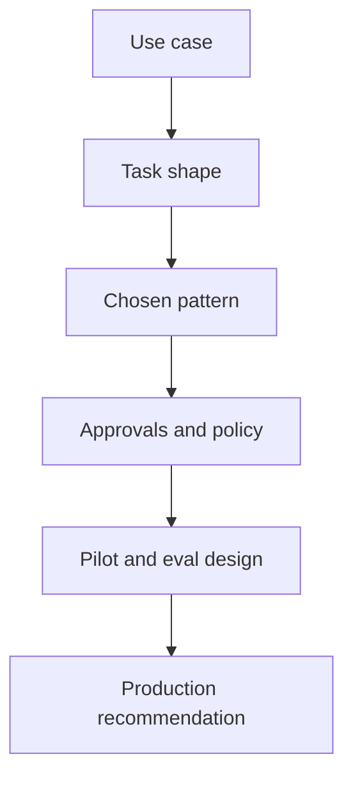

# Applied Agentic Architecture Case Studies

Applied agentic architecture case studies are compact examples that show how the same design method leads to different architectures depending on task shape, risk, tools, approvals, and operating constraints.

> [!INFO] Core idea
> Case studies are useful because they expose the reasoning behind architectural choices, not just the final diagram.

## Why It Matters
Methods and pattern tables help, but many readers only internalize architecture decisions when they can compare concrete scenarios. Case studies make trade-offs visible: why one system should stay a workflow, why another needs `ReAct`, and why a third should remain human-gated.

## Comparison Map

> [!IMPORTANT] Case studies should not pretend all examples belong in production
> Some examples are valuable precisely because the right conclusion is “keep it simpler” or “do not deploy yet.”

## Case Study Pattern
| Layer | What To Document |
| :--- | :--- |
| problem | what the team wants delegated |
| task shape | uncertainty, decomposition, external dependencies |
| chosen pattern | workflow, bounded loop, router, worker, human gate |
| tool and policy surface | available actions and approval boundary |
| pilot design | dataset, traces, and early success criteria |
| production recommendation | widen, constrain, redesign, or stop |

## Suggested Initial Cases
| Case | Likely Lesson |
| :--- | :--- |
| airline operations or support proposal | `ReAct` can be a useful probe, but approval design dominates the real architecture |
| internal documentation or research assistant | bounded tool loop often beats multi-agent complexity |
| coding-agent triage flow | repo-local validation and reviewer handoff matter more than clever planning alone |
| high-risk external action system | human-gated design may be the correct steady-state, not a temporary concession |

> [!WARNING] A case study is not a reusable template by default
> Similar-looking domains can still need different architectures because the tool surface, risk boundary, and eval shape differ.

## How To Use This Note
- compare cases before choosing a pattern
- use the same evaluation lens across cases
- identify which part of the architecture is domain-specific and which part is reusable
- treat failed or constrained cases as equally valuable learning material

## Failure Modes
- turning case studies into canned blueprints
- ignoring why a case was rejected or constrained
- documenting the final pattern without the rejected alternatives
- confusing a polished proposal with a production recommendation

> [!TIP] Practical default
> Write each case with one paragraph on why the chosen pattern beat a simpler alternative and one paragraph on what would stop it from reaching production.

## Related Notes
- Prerequisites: [[Applied Agentic Architectures]], [[Architecture Design Methods for Agent Systems]]
- Related: [[Proposal-to-Production for Agent Systems]], [[Orchestration Trade-offs and Pattern Selection]], [[Software Engineering Agents]]

## Sources
- [A practical guide to building agents | OpenAI](https://openai.com/business/guides-and-resources/a-practical-guide-to-building-ai-agents/)
- [Building Effective AI Agents | Anthropic](https://www.anthropic.com/engineering/building-effective-agents)
- [How we built our multi-agent research system | Anthropic](https://www.anthropic.com/engineering/multi-agent-research-system)
- [Introducing the Codex app | OpenAI](https://openai.com/index/introducing-the-codex-app/)
- See [[Agentic Systems Sources and Research Log]]

## Last Reviewed
- 2026-04-18
