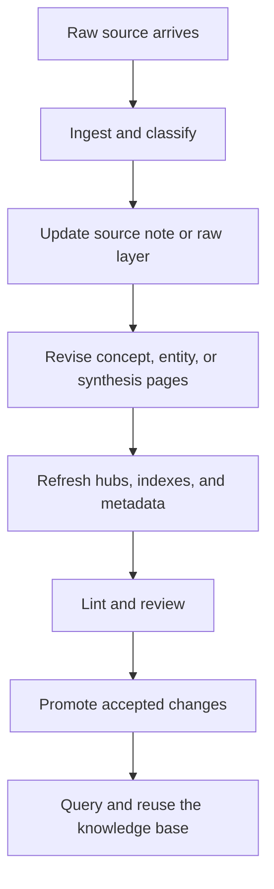

# Knowledge and Editorial Agents

Knowledge and editorial agents are agent systems designed to ingest sources, maintain structured notes, update indexes, and help a human keep a knowledge base coherent over time.

> [!INFO] Core idea
> The goal is not just to answer a question. It is to maintain a durable artifact such as a wiki, vault, handbook, research log, or course notes set that keeps getting better as new material arrives.

## Why It Matters
This is one of the most practical agentic patterns for serious individual or team use. A coding agent changes code. A knowledge or editorial agent changes the memory layer that people and other agents work from. That makes review, provenance, and note design as important as prompting.

## Executive Lens
| Artifact | Agentic Job | Human Value | Main Risk |
| :--- | :--- | :--- | :--- |
| research wiki | compile sources into linked concepts and syntheses | repeated cross-source understanding | durable hallucinations |
| editorial vault | maintain notes, hubs, and source logs | less bookkeeping and better navigation | silent drift in note quality |
| decision log | capture changes, tradeoffs, and rationale | traceable memory for teams | partial or biased summaries |
| study notes set | build structured learning artifacts over time | compounding understanding instead of repeated rediscovery | over-compression and lost nuance |

> [!IMPORTANT] Bookkeeping is where agents help most
> Good knowledge agents do not replace judgment. They remove the mechanical work of summarizing, linking, filing, indexing, and keeping the structure coherent enough for humans to review.

## Knowledge-Agent Loop

## Technical Core
### What These Agents Operate Over
| Layer | Typical Contents | Why It Matters |
| :--- | :--- | :--- |
| source layer | articles, transcripts, PDFs, papers, meeting notes | keeps raw evidence separate from synthesis |
| compiled layer | concepts, entities, syntheses, comparisons, FAQs | gives the agent a durable knowledge surface |
| navigation layer | indexes, hubs, manifests, hot caches, dashboards | keeps retrieval cheap for both humans and agents |
| governance layer | frontmatter, aliases, lifecycle state, git history, review queues | prevents silent corruption and drift |

### Common Job Shapes
- ingest a new article and update existing concept pages
- convert repeated chat discoveries into stable synthesis notes
- maintain source registries and research logs
- refresh course notes, study hubs, and cross-links after new reading
- keep an Obsidian vault or Markdown wiki usable as a long-term memory surface

### Core Handoff
This subline assumes the shared branch core has already covered what an agent is, how tools interact with an environment, how memory works, and why evaluation and governance matter.

| Shared Core Note | Why It Matters Before This Subline |
| :--- | :--- |
| [[020 AI Agents\|AI Agents]] | frames the system as an agent, not just a note-taking macro |
| [[025 Knowledge Compilation vs RAG\|Knowledge Compilation vs RAG]] | clarifies when compiled knowledge is the right pattern |
| [[030 Tool Use and Environment Interaction\|Tool Use and Environment Interaction]] | makes file, search, and ingest boundaries explicit |
| [[070 Memory in Agent Systems\|Memory in Agent Systems]] | distinguishes working context from durable memory artifacts |
| [[100 Evaluation, Observability, and Governance for Agent Systems\|Evaluation, Observability, and Governance for Agent Systems]] | keeps the wiki or vault tied to review and trust, not just output volume |

### Mini-Track Map
| Stage | Best Notes | Outcome |
| :--- | :--- | :--- |
| Core handoff | [[025 Knowledge Compilation vs RAG\|Knowledge Compilation vs RAG]], [[020 AI Agents\|AI Agents]], [[070 Memory in Agent Systems\|Memory in Agent Systems]] | understand why this pattern exists and when it fits |
| Apprenticeship | [[085 Knowledge and Editorial Agents\|Knowledge and Editorial Agents]], [[090 LLM Wiki and Agentic Knowledge Bases\|LLM Wiki and Agentic Knowledge Bases]] | build a small, reviewable knowledge base the agent can maintain |
| Advanced | [[095 Editorial Review Loops for AI-Maintained Knowledge\|Editorial Review Loops for AI-Maintained Knowledge]], [[040 Validation and Eval Design for Agent Architectures\|Validation and Eval Design for Agent Architectures]] | govern ingest, promotion, and trust in a repeatable way |
| Mastery | [[050 Proposal-to-Production for Agent Systems\|Proposal-to-Production for Agent Systems]], [[100 Applied Agentic Architecture Case Studies\|Applied Agentic Architecture Case Studies]], [[100 Evaluation, Observability, and Governance for Agent Systems\|Evaluation, Observability, and Governance for Agent Systems]] | run knowledge agents as durable infrastructure rather than demos |

> [!WARNING] Not every notes workflow needs an agent
> If the corpus is tiny, rarely updated, or mostly personal scratch space, a manual system may be cleaner. Agentic maintenance pays off when the bookkeeping load keeps returning.

## Design Patterns and Failure Modes
### Strong patterns
- keep raw sources separate from compiled notes
- use atomic pages with explicit metadata and aliases
- maintain lightweight indexes so the agent does not read everything every time
- require a review step before promoting important syntheses into canonical notes
- let the agent propose structure, but keep humans in charge of truth, scope, and promotion

### Failure modes
- turning the vault into a dumping ground of unreviewed summaries
- using the graph as proof of knowledge quality
- rewriting canonical notes directly from noisy source material
- mixing temporary session memory with long-term knowledge artifacts
- allowing the wiki to cite itself instead of the raw evidence

> [!TIP] Practical default
> Use the agent as a disciplined editor: ingest, summarize, link, lint, and propose. Keep final promotion of high-value knowledge in human hands.

## Related Notes
- Prerequisites: [[025 Knowledge Compilation vs RAG|Knowledge Compilation vs RAG]], [[020 AI Agents|AI Agents]], [[070 Memory in Agent Systems|Memory in Agent Systems]]
- Related: [[090 LLM Wiki and Agentic Knowledge Bases|LLM Wiki and Agentic Knowledge Bases]], [[095 Editorial Review Loops for AI-Maintained Knowledge|Editorial Review Loops for AI-Maintained Knowledge]], [[80 Knowledge Ops/010 Knowledge Ops|Knowledge Ops]], [[80 Knowledge Ops/20 Domain Workspaces/05 Agentic Systems/010 Agentic Systems Knowledge Workspace|Agentic Systems Knowledge Workspace]], [[010 Applied Agentic Architectures|Applied Agentic Architectures]], [[050 Proposal-to-Production for Agent Systems|Proposal-to-Production for Agent Systems]], [[100 Applied Agentic Architecture Case Studies|Applied Agentic Architecture Case Studies]]

## Sources
- [LLM Wiki | Andrej Karpathy](https://gist.github.com/karpathy/442a6bf555914893e9891c11519de94f)
- [Effective context engineering for AI agents | Anthropic](https://www.anthropic.com/engineering/effective-context-engineering-for-ai-agents)
- [Pratiyush/llm-wiki | GitHub](https://github.com/Pratiyush/llm-wiki)
- [praneybehl/llm-wiki-plugin | GitHub](https://github.com/praneybehl/llm-wiki-plugin)
- [AgriciDaniel/claude-obsidian | GitHub](https://github.com/AgriciDaniel/claude-obsidian)
- See [[010 Agentic Systems Sources and Research Log|Agentic Systems Sources and Research Log]]

## Last Reviewed
- 2026-04-20
