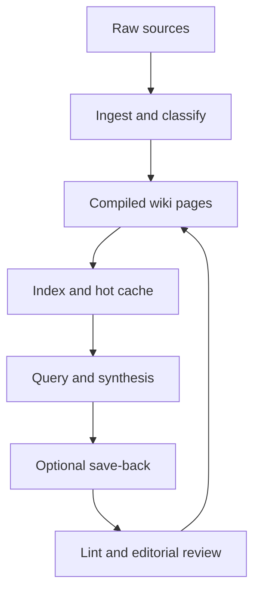

# LLM Wiki and Agentic Knowledge Bases

An `LLM wiki` is a practical pattern where an agent builds and maintains a structured Markdown knowledge base from raw sources, instead of rediscovering the same relationships from scratch on every query.

> [!INFO] Core idea
> A good agentic knowledge base sits between you and the raw source material. The agent compiles sources into linked notes, updates them over time, and keeps the structure navigable enough that both humans and other agents can reuse it.

## Why It Matters
For research, documentation, study notes, and long-running projects, the problem is often not "answer this one question". The problem is "keep the knowledge layer usable as the corpus grows". This is where a compiled wiki can outperform pure `RAG`: repeated synthesis, durable structure, and lower re-explanation cost.

## Executive Lens
| Question | Good Default | Why |
| :--- | :--- | :--- |
| should I use this at all? | only for curated, repeated, high-value domains | maintenance only pays off if the same knowledge will be reused |
| what should stay immutable? | raw sources | you need a recovery surface when the compiled layer drifts |
| what should the agent write? | concept, entity, synthesis, and index pages | these are the durable artifacts that compound |
| what should humans still own? | promotion, truth checks, schema changes, and editorial scope | trust does not come from generation alone |

> [!IMPORTANT] Do not let the agent write directly into your crown jewels
> Use an explicit draft or review layer before important compiled pages become canonical. The wiki should be editable infrastructure, not a silent truth machine.

## Reference Architecture


### Recommended Layers
| Layer | Contents | Rule |
| :--- | :--- | :--- |
| raw | articles, transcripts, PDFs converted to text, meeting notes, exports | keep immutable whenever possible |
| wiki | concepts, entities, sources, syntheses, comparisons, questions | keep atomic and interlinked |
| navigation | `index.md`, sharded indexes, hot cache, dashboards, manifests | keep cheap to scan |
| governance | schema, frontmatter, aliases, lifecycle state, lint rules, git history | keep explicit and reviewable |

### Reference Folder Shape
```text
topic-wiki/
  raw/
    articles/
    transcripts/
    meeting-notes/
  wiki/
    concepts/
    entities/
    sources/
    syntheses/
    indexes/
    hot.md
    SCHEMA.md
    index.md
  review/
    drafts/
    lint-reports/
```

> [!TIP] Smallest useful version
> You do not need a huge framework to start. A useful first version is `raw/`, `wiki/`, `index.md`, `hot.md`, and a short `SCHEMA.md` that tells the agent what kinds of pages exist.

## How To Do It Well
### 1. Keep Raw And Compiled Layers Separate
- raw sources are evidence
- wiki pages are maintained syntheses
- review artifacts are temporary control surfaces

If you mix these layers, the agent loses the ability to check itself against the original material.

### 2. Keep Pages Atomic
| Page Type | Good Shape | Why |
| :--- | :--- | :--- |
| source page | one source, one provenance record | preserves evidence and metadata |
| concept page | one concept or claim cluster | keeps retrieval bounded |
| entity page | one person, tool, company, or project | makes cross-source updates cheaper |
| synthesis page | one question or durable conclusion | lets the wiki compound without swallowing everything |
| index or hub | one-line summaries and curated entry points | avoids loading the whole wiki every time |

Good defaults:
- soft page cap around a few hundred lines
- one concept per page
- explicit aliases for renamed or canonicalized terms
- frontmatter on every durable page

### 3. Use Index-First Retrieval
The agent should not open the whole wiki on every task. A practical sequence is:
1. read `hot.md` for recent active context
2. read `index.md` or a domain sub-index
3. pull only candidate pages
4. fall back to raw sources only when the compiled layer is weak, stale, or disputed

This matches current context-engineering guidance: cheap navigation first, expensive detail only when needed.

### 4. Keep A Short Hot Cache
`hot.md` or an equivalent file should contain:
- active research threads
- unresolved questions
- near-term priorities
- recent accepted conclusions

It should not become a second wiki. If it grows too large, it stops being a cache.

### 5. Make Provenance Visible
Use frontmatter or explicit sections for:
- source list
- updated date
- status or lifecycle
- tags or domain
- aliases

If a synthesis matters, the human reviewer should be able to answer "where did this come from?" without asking the model again.

### 6. Save Good Queries Back Carefully
Saving answers back into the wiki is powerful, but only when done selectively.

Good candidates:
- durable explanations you expect to reuse
- comparisons that connect multiple sources
- open questions worth tracking
- resolved contradictions or renamed concepts

Bad candidates:
- one-off chat answers
- speculative thoughts without source grounding
- redundant rephrasings of existing pages

### 7. Treat Linting As A First-Class Operation
Useful lint checks include:
- broken wikilinks
- orphan pages
- missing frontmatter
- duplicate concepts
- stale pages
- oversized pages
- missing source attribution

Some community implementations also use BM25 fallback, sharded indexes, and health checks for link density and stale claims. Those are worth adding once the wiki starts to grow.

> [!WARNING] The graph can lie
> A beautiful graph does not prove the knowledge base is good. Dense linking can hide stale claims, circular summaries, duplicates, or pages that are only echoing prior wiki output.

## Obsidian-First Defaults
| Obsidian Feature | Use It For | Why It Helps |
| :--- | :--- | :--- |
| wikilinks | concept and entity linking | keeps navigation cheap and legible |
| aliases | renamed notes and alternate terms | preserves stable graph behavior after note normalization |
| properties | structured metadata in frontmatter | powers queries, dashboards, and review filters |
| graph view | structural inspection | useful for navigation, not for truth validation |
| Bases or dashboards | review queues and metadata browsing | supports maintenance without replacing hubs |

### Good Obsidian Habits
- keep canonical titles stable after concepts settle
- use aliases when you rename or normalize notes
- keep frontmatter small but consistent
- favor local graph or hub notes over global graph for real navigation
- keep dashboards as maintenance surfaces, not as the primary reading path

## When To Use Hybrid With `RAG`
| Situation | Better Default |
| :--- | :--- |
| small curated corpus with repeated questions | compiled wiki first |
| large or high-churn corpus | `RAG` first |
| stable concepts plus fresh evidence | hybrid |
| legal, medical, or audit-heavy search where citation traceability dominates | raw-source retrieval with strict review |
| long-running research or study where synthesis compounds over time | compiled wiki plus raw fallback |

## Minimal Operating Playbook
1. Pick one bounded topic instead of your whole life or whole company.
2. Create `raw/`, `wiki/`, `index.md`, `hot.md`, and `SCHEMA.md`.
3. Define the page types the agent is allowed to create.
4. Ingest a small curated set of sources first.
5. Review the first wave of pages manually and correct schema mistakes early.
6. Add linting before the wiki gets large.
7. Save only high-value syntheses back into the wiki.
8. Use git so every ingest and promotion step stays diffable.
9. Revisit page size, duplicate concepts, and index structure as the wiki grows.

> [!CAUTION] Start narrower than your ambition
> `LLM wiki` systems feel magical early, then collapse under editorial debt if the scope is too broad. One topic, one project, one reading stream, or one team handbook is the right starting unit.

## Design Patterns and Failure Modes
### Strong patterns
- immutable raw layer plus editable compiled layer
- schema file that tells the agent what a good page looks like
- index-first navigation and bounded page reads
- frontmatter and aliases on every durable page
- save-back only for durable syntheses
- git-backed review before promotion into canonical knowledge

### Failure modes
- wiki-reads-its-own-output drift
- giant summaries that become context bottlenecks
- constant full rewrites instead of surgical edits
- no provenance on generated pages
- turning every chat answer into a permanent page
- trying to replace all search and retrieval with the wiki
- enterprise-scale ingestion without explicit curation or review capacity

## Vault Implementation
This vault now treats the `LLM wiki` pattern as a concrete operating layer rather than only a design idea.

| Layer | Vault Location | Purpose |
| :--- | :--- | :--- |
| raw intake | [[80 Knowledge Ops/00 Intake/010 Intake Workspace\|Intake Workspace]] | immutable source capture |
| source normalization | [[80 Knowledge Ops/10 Source Notes/010 Source Notes Index\|Source Notes Index]] | one normalized note per source |
| domain compilation | [[80 Knowledge Ops/20 Domain Workspaces/05 Agentic Systems/010 Agentic Systems Knowledge Workspace\|Agentic Systems Knowledge Workspace]] | hot context, drafts, and candidate syntheses |
| policy and schema | [[80 Knowledge Ops/30 Schemas and Policies/010 Knowledge Ops Schema\|Knowledge Ops Schema]] | lifecycle, metadata, and workflow rules |
| promotion and lint | [[80 Knowledge Ops/40 Registries and Logs/030 Promotion Queue\|Promotion Queue]], [[80 Knowledge Ops/40 Registries and Logs/040 Lint Queue\|Lint Queue]] | supervised canon control |

## Related Notes
- Prerequisites: [[025 Knowledge Compilation vs RAG|Knowledge Compilation vs RAG]], [[070 Memory in Agent Systems|Memory in Agent Systems]]
- Related: [[085 Knowledge and Editorial Agents|Knowledge and Editorial Agents]], [[095 Editorial Review Loops for AI-Maintained Knowledge|Editorial Review Loops for AI-Maintained Knowledge]], [[80 Knowledge Ops/010 Knowledge Ops|Knowledge Ops]], [[80 Knowledge Ops/30 Schemas and Policies/020 Source Ingestion and Media Normalization|Source Ingestion and Media Normalization]], [[80 Knowledge Ops/30 Schemas and Policies/040 Promotion and Canon Policy|Promotion and Canon Policy]], [[010 Applied Agentic Architectures|Applied Agentic Architectures]], [[030 Tool Use and Environment Interaction|Tool Use and Environment Interaction]], [[100 Evaluation, Observability, and Governance for Agent Systems|Evaluation, Observability, and Governance for Agent Systems]]

## Sources
- [LLM Wiki | Andrej Karpathy](https://gist.github.com/karpathy/442a6bf555914893e9891c11519de94f)
- [Effective context engineering for AI agents | Anthropic](https://www.anthropic.com/engineering/effective-context-engineering-for-ai-agents)
- [praneybehl/llm-wiki-plugin | GitHub](https://github.com/praneybehl/llm-wiki-plugin)
- [AgriciDaniel/claude-obsidian | GitHub](https://github.com/AgriciDaniel/claude-obsidian)
- [atomicmemory/llm-wiki-compiler | GitHub](https://github.com/atomicmemory/llm-wiki-compiler)
- [Pratiyush/llm-wiki | GitHub](https://github.com/Pratiyush/llm-wiki)
- [Mnemonio | Persistent Memory for LLM Agents](https://mnemonio.com/)
- [Aliases | Obsidian Help](https://obsidian.md/help/aliases)
- [Properties | Obsidian Help](https://obsidian.md/help/properties)
- [Graph view | Obsidian Help](https://obsidian.md/help/plugins/graph)
- See [[010 Agentic Systems Sources and Research Log|Agentic Systems Sources and Research Log]]

## Last Reviewed
- 2026-04-20
