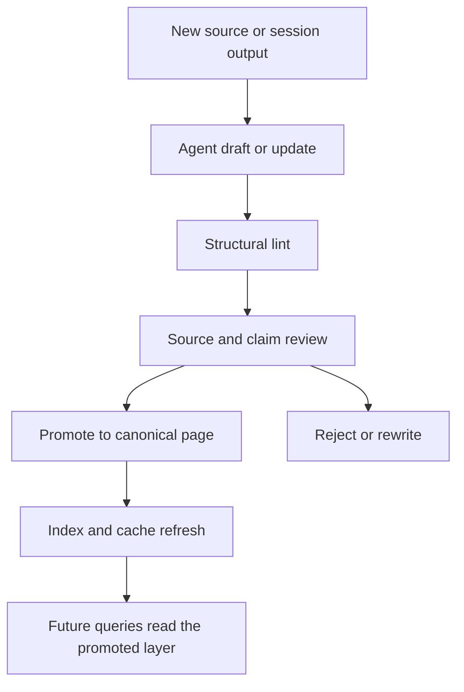

# Editorial Review Loops for AI-Maintained Knowledge

If an agent is allowed to maintain a wiki, vault, or handbook, then review is part of the architecture. Without an editorial loop, you do not have a knowledge system. You have a pile of generated text.

> [!INFO] Core idea
> The agent should propose, revise, and lint. Humans should decide what becomes trusted, canonical, or shared.

## Why It Matters
A bad answer disappears. A bad wiki page persists, gets linked, and starts shaping later answers. The review loop is what turns agent output into a governed memory layer instead of a compounding hallucination engine.

## Review Loop

> [!IMPORTANT] Promotion is the control point
> The most important boundary is not whether the agent can write files. It is whether unreviewed files can become part of the trusted layer that later queries and summaries consume.

## Technical Core
### Review Surfaces
| Surface | What To Check | Default Owner |
| :--- | :--- | :--- |
| raw ingest | correct source capture, no truncation, sane metadata | writing agent plus quick human spot check |
| concept or entity page update | factual drift, duplicates, broken scope | human reviewer |
| synthesis page | source grounding, usefulness, and whether it deserves permanence | human reviewer |
| index and hub changes | navigability and note placement | editor or structure reviewer |
| lifecycle changes | whether draft, reviewed, verified, stale, or archived is justified | human reviewer or editor |

### Recommended Lifecycle
| State | Meaning | Promotion Rule |
| :--- | :--- | :--- |
| `draft` | agent-created or materially rewritten but unreviewed | never treat as canonical |
| `reviewed` | human checked structure and main claims | safe for local reuse with caution |
| `verified` | high-trust page with explicit source support | safe for repeated downstream use |
| `stale` | likely outdated or superseded | keep visible but do not treat as current |
| `archived` | retained for history, no longer active | exclude from default agent context |

### Human And Agent Responsibilities
| Task | Agent Role | Human Role |
| :--- | :--- | :--- |
| ingest source | parse, classify, file, and propose updates | confirm source quality for important material |
| maintain links and indexes | update hubs, aliases, manifests, and summaries | validate navigation still makes sense |
| generate syntheses | propose reusable notes and comparisons | decide what deserves permanence |
| run lint and health checks | detect structural problems early | prioritize and approve fixes |
| settle contradictions | flag likely conflicts | arbitrate truth and wording |

> [!WARNING] The wiki can start citing itself
> One of the most dangerous failure modes is self-referential drift: later summaries trust prior wiki pages instead of checking the raw sources. Review policy has to break that loop.

## Practical Default Workflow
1. Agent ingests or updates into a draft layer.
2. Lint runs before the human sees the changes.
3. Human checks source attribution, concept boundaries, and duplicates.
4. Important syntheses get promoted; noisy or weak ones stay draft or get deleted.
5. After promotion, the index and hot cache refresh.
6. Periodically review stale pages, aliases, and oversized pages.

### Good Review Checklist
- is the raw source captured correctly?
- does the page stay within its intended scope?
- does the note cite or point back to the real evidence?
- did the agent merge concepts that should remain separate?
- did the update silently change the meaning of an existing canonical note?
- should this page be promoted, left draft, or archived?

### Good Git And Vault Defaults
- review diffs in git for every meaningful ingest batch
- avoid giant whole-vault rewrites
- keep review agents read-only by default
- let one writing agent own the path scope for a given batch
- use hubs and dashboards to surface review queues, not as a substitute for review

> [!TIP] Personal default
> Even for a personal vault, use a two-step pattern: agent proposes and lint checks first, then you promote only the pages you want the system to rely on later.

## Design Patterns and Failure Modes
### Strong patterns
- draft-first promotion policy
- source attribution in frontmatter or body
- explicit lifecycle states
- regular stale-page review
- separate structure review from truth review
- one writing agent per scope, review agents read-only

### Failure modes
- silent corruption from bad ingest
- maintenance ratchet where lint debt grows faster than review capacity
- duplicate concepts with near-identical names
- character or formatting corruption after repeated rewrites
- treating "reviewed once" as "verified forever"
- no archive path for stale knowledge

## Related Notes
- Prerequisites: [[085 Knowledge and Editorial Agents|Knowledge and Editorial Agents]], [[090 LLM Wiki and Agentic Knowledge Bases|LLM Wiki and Agentic Knowledge Bases]]
- Related: [[025 Knowledge Compilation vs RAG|Knowledge Compilation vs RAG]], [[80 Knowledge Ops/30 Schemas and Policies/040 Promotion and Canon Policy|Promotion and Canon Policy]], [[80 Knowledge Ops/40 Registries and Logs/030 Promotion Queue|Promotion Queue]], [[80 Knowledge Ops/40 Registries and Logs/040 Lint Queue|Lint Queue]], [[040 Validation and Eval Design for Agent Architectures|Validation and Eval Design for Agent Architectures]], [[050 Proposal-to-Production for Agent Systems|Proposal-to-Production for Agent Systems]], [[100 Evaluation, Observability, and Governance for Agent Systems|Evaluation, Observability, and Governance for Agent Systems]]

## Sources
- [LLM Wiki | Andrej Karpathy](https://gist.github.com/karpathy/442a6bf555914893e9891c11519de94f)
- [Effective context engineering for AI agents | Anthropic](https://www.anthropic.com/engineering/effective-context-engineering-for-ai-agents)
- [Pratiyush/llm-wiki | GitHub](https://github.com/Pratiyush/llm-wiki)
- [praneybehl/llm-wiki-plugin | GitHub](https://github.com/praneybehl/llm-wiki-plugin)
- [Turned Andrej Karpathy's "LLM Wiki" gist into a Claude Code plugin | Reddit](https://www.reddit.com/r/ClaudeCode/comments/1sm374u/turned_andrej_karpathys_llm_wiki_gist_into_a/)
- [Aliases | Obsidian Help](https://obsidian.md/help/aliases)
- [Properties | Obsidian Help](https://obsidian.md/help/properties)
- See [[010 Agentic Systems Sources and Research Log|Agentic Systems Sources and Research Log]]

## Last Reviewed
- 2026-04-20
