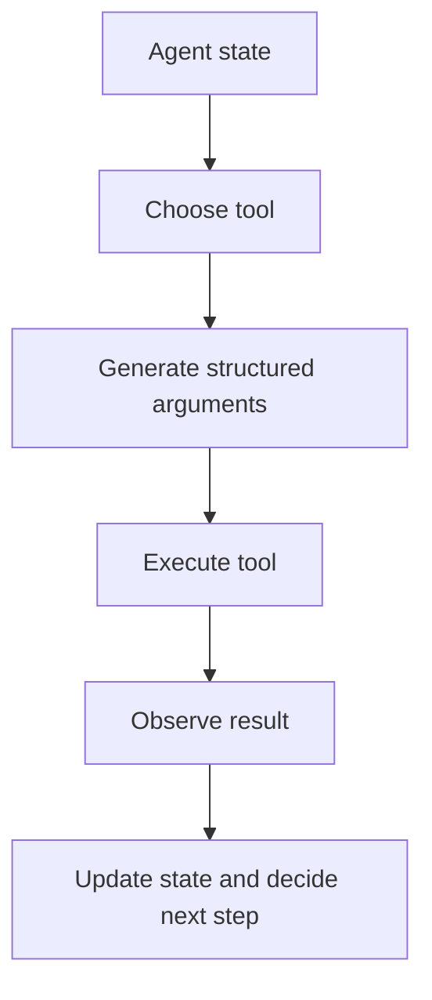

# Tool Use and Environment Interaction

Tool use is the mechanism that lets an agent move beyond text generation and interact with external systems, software, data, or environments.

> [!INFO] Core idea
> Good agentic tool use depends less on “smart prompting” and more on strong interfaces: clear schemas, narrow permissions, and reliable observations.

## Why It Matters
Without tools, an agent is mostly limited to reasoning over its context window. With tools, it can search, inspect files, call APIs, browse, compute, and act, but that power introduces new reliability and safety challenges.

## Executive Lens
| Tool Pattern | Best For | Return Signal | Operational Risk |
| :--- | :--- | :--- | :--- |
| Built-in tools | common agent actions | fastest time to value with strong defaults | platform dependence |
| Custom function tools | domain-specific actions | highest ROI when tools map to stable business operations | schema, permissions, and maintenance burden |
| MCP / connector-style integrations | many external systems | reuse and interoperability across teams or platforms | approval, trust, and boundary complexity |

> [!IMPORTANT] Tool quality is an architecture issue
> If tools are ambiguous, under-specified, or overly broad, the model has to guess too much. That usually looks like intelligence failure but is often interface failure.

A connector is a reusable adapter that exposes an external system through a standard interface, so the agent does not need a bespoke integration pattern for every target system.

## Technical Core
### Minimal Interaction Loop

### What a Strong Tool Contract Needs
- stable name and clear purpose
- structured input schema
- predictable output shape
- clear permission boundary
- understandable failure states

> [!WARNING] Untrusted tool output is still input
> Search results, page text, or API responses can carry prompt-injection style content. Tool output should not automatically gain privileged status.

## Design Patterns and Failure Modes
### Useful patterns
- keep the tool catalog small and well documented
- separate read tools from write or high-impact tools
- require approval for privileged or irreversible actions
- use MCP / connectors as examples of reusable interoperability rather than as the whole conceptual model

### Failure modes
- wrong tool selected
- arguments malformed
- documentation stale
- permissions too broad
- side effects triggered without enough review

> [!CAUTION] Tool catalogs do not scale automatically
> As the number of tools grows, discovery, naming, and schema consistency become core system problems.

> [!TIP] Practical default
> Fewer tools with stronger schemas usually outperform large vague tool catalogs.

## Related Notes
- Prerequisites: [[AI Agents]]
- Related: [[Planning and Control Flow in Agent Systems]], [[Evaluation, Observability, and Governance for Agent Systems]], [[Agent Architectures and Orchestration Patterns]]

## Sources
- [Toolformer: Language Models Can Teach Themselves to Use Tools (2023)](https://arxiv.org/abs/2302.04761)
- [Gorilla: Large Language Model Connected with Massive APIs (2023)](https://arxiv.org/abs/2305.15334)
- [OpenAI, "New tools for building agents" (2025-03-11)](https://openai.com/index/new-tools-for-building-agents/)
- [Anthropic Docs, "Define tools"](https://docs.anthropic.com/en/docs/agents-and-tools/tool-use/implement-tool-use)
- [OpenAI MCP docs](https://platform.openai.com/docs/mcp/)
- See [[Agentic Systems Sources and Research Log]]

## Last Reviewed
- 2026-04-10
