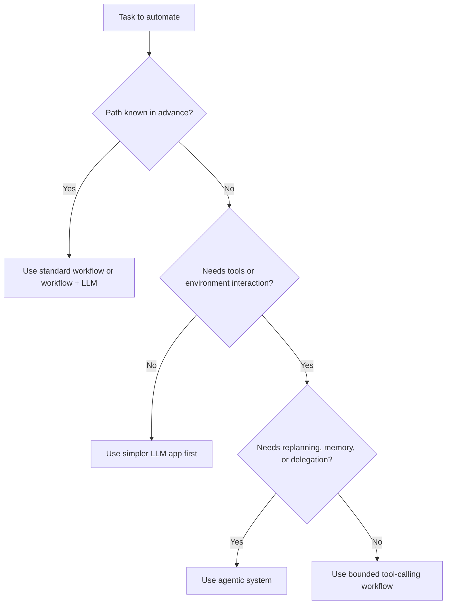

# When to Use Agentic Systems

Agentic systems are useful when a task requires flexible sequencing, tool use, and adaptation to environment feedback rather than a fixed predefined flow.

> [!INFO] Core question
> The right first question is not “Can I use an agent here?” but “Does this problem truly benefit from dynamic control flow?”

## Why It Matters
Agentic systems can unlock value on open-ended, tool-rich tasks, but they also introduce cost, latency, governance risk, and more failure modes than simpler workflows.

## Executive Lens
| Approach | Use When | Avoid When | Investment Signal |
| :--- | :--- | :--- | :--- |
| Standard software workflow | logic is deterministic and stable | the path changes based on environment feedback | lowest operating cost and best default |
| `RAG` or retrieval-only LLM app | the main problem is knowledge access | the system must act, plan, or branch dynamically | cheapest grounding upgrade |
| Bounded tool-calling workflow | tools are needed but steps and stop conditions are still mostly known | the system must replan often or own state across many decisions | useful middle ground before true agents |
| Single-agent system | the task needs tool use and adaptive sequencing | the problem can be reduced to a fixed workflow or bounded controller | justify when flexibility removes manual coordination or rework |
| Multi-agent system | work decomposes cleanly into roles or verification steps | you are adding agents just to appear advanced | justify only when specialization measurably improves quality or throughput |

> [!WARNING] Complexity tax
> The jump from workflow to agent is not free. You pay for it in orchestration logic, evaluation burden, latency, and operational risk.

## Technical Core
Agentic systems are usually justified when several of these conditions are true:
- the path to the answer is not known in advance
- the model must choose or sequence tools dynamically
- intermediate observations change the next step
- state must persist across multiple actions
- the system benefits from delegation or verification

### Compact Taxonomy
| System Shape | Next-Step Owner | Typical Stop Condition | State Owner | Approval Owner |
| :--- | :--- | :--- | :--- | :--- |
| Workflow | application code or rules engine | fixed business logic completes | application/database | business logic or human operator |
| Bounded tool workflow | controller with limited model choice | tool budget, known completion rule, or approval gate | controller plus session state | controller or human reviewer |
| Single-agent | model-guided loop under guardrails | success signal, tool budget, critic, or timeout | agent session state and memory | policy layer plus approvals |
| Multi-agent | orchestrator plus specialists | supervisor, verifier, or aggregator declares completion | shared plus role-local state | orchestrator, policy layer, and human review |

### Go / No-Go Decision Block
| Decision Lens | Move To A True Agent When | Stay With Workflow Or Bounded Tool Use When |
| :--- | :--- | :--- |
| Control complexity | the next step depends on observations and cannot be pre-scripted reliably | the path is stable enough to encode directly |
| Economic value | adaptive behavior saves material analyst time, reduces rework, or improves recovery on variable inputs | latency and ops cost would exceed the expected value |
| Governance readiness | you can deploy traces, task-level evals, and approval gates before rollout | failures would not be auditable or safely interruptible |

> [!IMPORTANT] Start with the minimum viable architecture
> Current official guidance from both OpenAI and Anthropic converges on the same rule: begin with the simplest loop that solves the task, then add complexity only when the evals justify it.

## Design Patterns and Failure Modes
### Strong use cases
- research or analysis with uncertain paths
- multi-step tool use across external systems
- long-lived tasks with iterative refinement
- environments where observation changes the next action

### Weak use cases
- tasks with stable business rules
- workflows with known deterministic branching
- cases where retrieval alone solves the grounding problem
- low-tolerance environments with no auditability or approval layer

> [!CAUTION] Multi-agent is not the default upgrade
> Most agent systems should start as a single-agent or bounded workflow design. Multi-agent systems only win when the work decomposes naturally.

### Failure modes
- overengineering a problem that only needed a workflow
- hidden latency from planning and retries
- brittle tools or permissions
- weak observability and no clear success criteria
- unreliable autonomy in high-stakes operations

> [!TIP] Practical default
> Start with workflow -> add bounded tool use -> add agent loop -> add delegation only if the evaluation data shows a real gain.

## Related Notes
- Prerequisites: [[Language Models]], [[RAG (Retrieval Augmented Generation)]]
- Related: [[AI Agents]], [[Agent Architectures and Orchestration Patterns]], [[Evaluation, Observability, and Governance for Agent Systems]]

## Sources
- [Anthropic, "Building Effective AI Agents" (2024-12-19)](https://www.anthropic.com/engineering/building-effective-agents)
- [OpenAI, "New tools for building agents" (2025-03-11)](https://openai.com/index/new-tools-for-building-agents/)
- [A Survey on Large Language Model based Autonomous Agents (2024)](https://arxiv.org/abs/2308.11432)
- [Large Language Model based Multi-Agents: A Survey of Progress and Challenges (2024)](https://arxiv.org/abs/2402.01680)
- See [[Agentic Systems Sources and Research Log]]

## Last Reviewed
- 2026-04-10
