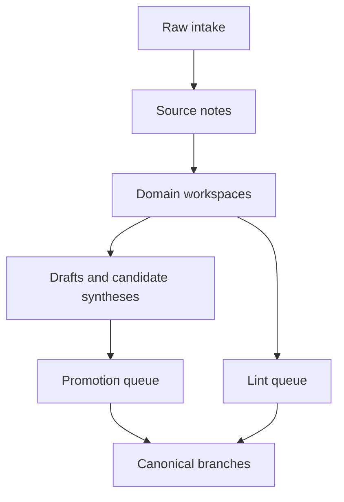

# Knowledge Ops

`Knowledge Ops` is the operational layer that turns this vault into a supervised, agent-maintained knowledge system. It is not a study branch. It is the runtime surface where sources enter, drafts accumulate, lint runs, and canonical promotions get reviewed.

> [!INFO] Start here
> Use this branch when you want to ingest sources, inspect promotion queues, refresh workspace context, or maintain the vault as a compounding knowledge base.

> [!IMPORTANT] Not a curriculum branch
> Readers should still enter through [[Home]] and the main indexes. `80 Knowledge Ops` exists to support source ingestion, draft maintenance, and promotion into the canonical branches, not to replace the learning path.

## Why It Matters
The vault already has a curated canon. `Knowledge Ops` adds the missing operating layer: immutable intake, normalized source notes, domain workspaces, lifecycle policy, and promotion control. That is what makes a `full Karpathy` workflow sustainable instead of turning into silent wiki drift.

## Runtime Map

## Onboarding Path
| If You Are... | Start Here | Then Read |
| :--- | :--- | :--- |
| new to the system | [[80 Knowledge Ops/020 Knowledge Ops Quickstart\|Knowledge Ops Quickstart]] | [[80 Knowledge Ops/040 Worked Example - PDF Ingest\|Worked Example - PDF Ingest]] |
| trying to copy this to another repo | [[80 Knowledge Ops/030 Karpathy Knowledge Base Starter Template\|Karpathy Knowledge Base Starter Template]] | [[80 Knowledge Ops/30 Schemas and Policies/010 Knowledge Ops Schema\|Knowledge Ops Schema]] |
| operating this vault day to day | [[80 Knowledge Ops/90 Dashboards/010 Knowledge Ops Dashboard\|Knowledge Ops Dashboard]] | [[80 Knowledge Ops/40 Registries and Logs/010 Global Knowledge Index\|Global Knowledge Index]] |

> [!TIP] Best sharing order
> If you want to show this system to teammates, send them the quickstart first, then the worked example, and only then the deeper policy notes.

## Operating Zones
| Zone | Purpose | Open |
| :--- | :--- | :--- |
| `00 Intake` | immutable raw sources and normalized assets | [[80 Knowledge Ops/00 Intake/010 Intake Workspace\|Intake Workspace]] |
| `10 Source Notes` | one normalized note per ingestable source | [[80 Knowledge Ops/10 Source Notes/010 Source Notes Index\|Source Notes Index]] |
| `20 Domain Workspaces` | agent-owned drafts, hot context, and candidate artifacts by domain | [[80 Knowledge Ops/40 Registries and Logs/010 Global Knowledge Index\|Global Knowledge Index]] |
| `30 Schemas and Policies` | the hard contract for ingest, query, lint, and promotion | [[80 Knowledge Ops/30 Schemas and Policies/010 Knowledge Ops Schema\|Knowledge Ops Schema]] |
| `40 Registries and Logs` | global index, activity log, promotion queue, lint queue, and canonical map | [[80 Knowledge Ops/40 Registries and Logs/010 Global Knowledge Index\|Global Knowledge Index]] |
| `90 Dashboards` | Bases and Dataview views for operational maintenance | [[80 Knowledge Ops/90 Dashboards/010 Knowledge Ops Dashboard\|Knowledge Ops Dashboard]] |

> [!TIP] Default operational loop
> `ingest -> normalize -> compile -> lint -> promote` is the default path. If a task skips promotion, it should stay in the workspace layer and not silently rewrite canon.

## Domain Workspaces
| Workspace | Purpose |
| :--- | :--- |
| [[80 Knowledge Ops/20 Domain Workspaces/01 Foundations/010 Foundations Knowledge Workspace\|Foundations Knowledge Workspace]] | compile and review source-backed additions for `01 Foundations` |
| [[80 Knowledge Ops/20 Domain Workspaces/02 Data Preparation/010 Data Preparation Knowledge Workspace\|Data Preparation Knowledge Workspace]] | support preprocessing and data-readiness research without cluttering canon |
| [[80 Knowledge Ops/20 Domain Workspaces/03 Classical ML/010 Classical ML Knowledge Workspace\|Classical ML Knowledge Workspace]] | hold candidate comparisons, model notes, and eval syntheses |
| [[80 Knowledge Ops/20 Domain Workspaces/04 Deep Learning & NLP/010 Deep Learning and NLP Knowledge Workspace\|Deep Learning and NLP Knowledge Workspace]] | ingest and compile LLM, sequence, and retrieval material before promotion |
| [[80 Knowledge Ops/20 Domain Workspaces/05 Agentic Systems/010 Agentic Systems Knowledge Workspace\|Agentic Systems Knowledge Workspace]] | highest-density runtime layer for the current `full Karpathy` rollout |

## Related Notes
- Related: [[80 Knowledge Ops/020 Knowledge Ops Quickstart|Knowledge Ops Quickstart]], [[80 Knowledge Ops/030 Karpathy Knowledge Base Starter Template|Karpathy Knowledge Base Starter Template]], [[80 Knowledge Ops/040 Worked Example - PDF Ingest|Worked Example - PDF Ingest]], [[80 Knowledge Ops/30 Schemas and Policies/020 Source Ingestion and Media Normalization|Source Ingestion and Media Normalization]], [[80 Knowledge Ops/30 Schemas and Policies/040 Promotion and Canon Policy|Promotion and Canon Policy]], [[80 Knowledge Ops/90 Dashboards/010 Knowledge Ops Dashboard|Knowledge Ops Dashboard]], [[090 LLM Wiki and Agentic Knowledge Bases|LLM Wiki and Agentic Knowledge Bases]]

## Sources
- [LLM Wiki | Andrej Karpathy](https://gist.github.com/karpathy/442a6bf555914893e9891c11519de94f)
- [Effective context engineering for AI agents | Anthropic](https://www.anthropic.com/engineering/effective-context-engineering-for-ai-agents)

## Last Reviewed
- 2026-04-21
