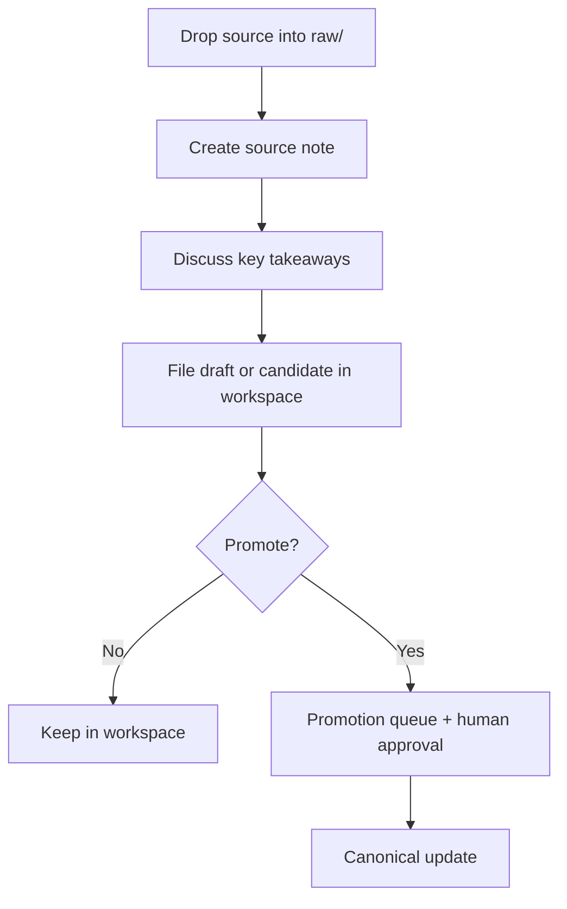

# Knowledge Ops Quickstart

This quickstart is the shortest path to using `Knowledge Ops` correctly without reading the entire operating layer first.

> [!INFO] What this is for
> Use this note when you want to start ingesting sources and maintaining a compounding knowledge base with agents, but you do not want to learn the whole system by reading every policy note in order.

> [!IMPORTANT] Default promise
> `Knowledge Ops` is designed so the agent can move quickly inside the operational layer while the canonical vault remains supervised. New sources should flow through `raw -> source note -> workspace -> promotion queue`, not straight into canon.

> [!WARNING] Ingest and promotion are different approvals
> Telling the agent to process a source is enough for ingest, normalization, and workspace filing. It is not enough for canonical promotion. Promotion should happen only after the key takeaways have been discussed and the user explicitly approves the promotion step.

## The Four Things To Understand First
| Layer | What It Holds | Default Owner |
| :--- | :--- | :--- |
| `raw` | immutable source files or clips | human deposits, agent reads |
| `source notes` | normalized provenance and summary for one source | agent writes |
| `domain workspaces` | hot context, drafts, questions, and candidate syntheses | agent writes |
| `canon` | stable branch notes in `01` to `05` | human-supervised promotion |

## Default Operational Loop

## First-Run Workflow
1. Put the source in [raw](</Users/carloslopezdelizaga/Documents/Obsidian Vault/80 Knowledge Ops/00 Intake/raw>).
2. Tell the agent to ingest it.
3. Let the agent create a source note and summarize the source.
4. Review the key takeaways together.
5. Decide what deserves emphasis.
6. Let the agent file a draft or promotion candidate.
7. Approve promotion only if you want canon updated.

> [!TIP] Best beginner default
> Ingest one source at a time and stay involved during the takeaway discussion. That is the easiest way to keep the knowledge base useful instead of letting it drift into generic summaries.

## What To Say To The Agent
| Goal | Good Prompt |
| :--- | :--- |
| ingest a source | `Ingest this PDF into Knowledge Ops and give me the key takeaways before proposing canon changes.` |
| keep it non-canonical | `Process this source, but stop at source note plus workspace candidate.` |
| allow promotion | `Integrate this into the canon after we discuss the takeaways.` |
| run a maintenance pass | `Run a lint pass on this workspace and surface stale or duplicate areas.` |

## Where To Start In This Vault
| Need | Open |
| :--- | :--- |
| understand the operating layer | [[80 Knowledge Ops/010 Knowledge Ops\|Knowledge Ops]] |
| see the schema and lifecycle | [[80 Knowledge Ops/30 Schemas and Policies/010 Knowledge Ops Schema\|Knowledge Ops Schema]] |
| ingest and normalization policy | [[80 Knowledge Ops/30 Schemas and Policies/020 Source Ingestion and Media Normalization\|Source Ingestion and Media Normalization]] |
| promotion rules | [[80 Knowledge Ops/30 Schemas and Policies/040 Promotion and Canon Policy\|Promotion and Canon Policy]] |
| operational dashboard | [[80 Knowledge Ops/90 Dashboards/010 Knowledge Ops Dashboard\|Knowledge Ops Dashboard]] |
| worked example | [[80 Knowledge Ops/040 Worked Example - PDF Ingest\|Worked Example - PDF Ingest]] |

## Anti-Patterns
- dumping sources straight into canonical notes
- treating every chat answer as durable knowledge
- skipping the takeaway discussion for important new sources
- letting workspace drafts accumulate without promotion or rejection
- using `Knowledge Ops` as the primary learning path instead of the branch indexes

## Related Notes
- Related: [[80 Knowledge Ops/010 Knowledge Ops|Knowledge Ops]], [[80 Knowledge Ops/030 Karpathy Knowledge Base Starter Template|Karpathy Knowledge Base Starter Template]], [[80 Knowledge Ops/040 Worked Example - PDF Ingest|Worked Example - PDF Ingest]]

## Sources
- [LLM Wiki | Andrej Karpathy](https://gist.github.com/karpathy/442a6bf555914893e9891c11519de94f)
- [[80 Knowledge Ops/30 Schemas and Policies/020 Source Ingestion and Media Normalization|Source Ingestion and Media Normalization]]
- [[80 Knowledge Ops/30 Schemas and Policies/040 Promotion and Canon Policy|Promotion and Canon Policy]]

## Last Reviewed
- 2026-04-21
