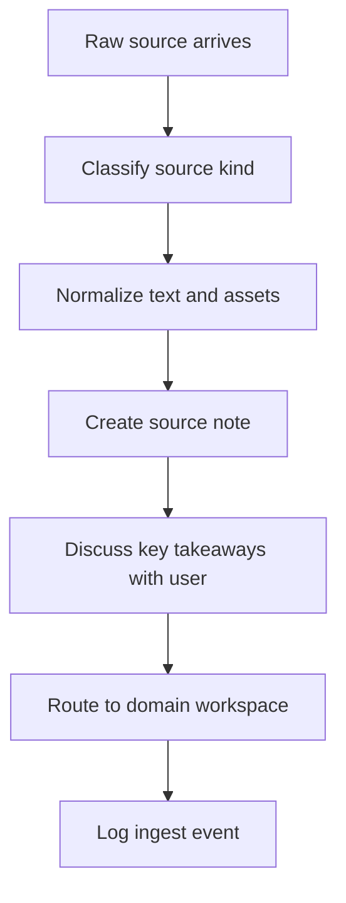

# Source Ingestion and Media Normalization

This policy governs how new source material enters the vault and what “clean enough to compile” means.

> [!INFO] Curated manual-first
> The default intake model is explicit and curated: PDFs, web clips, transcripts, GitHub docs, snippets, and meeting notes are deposited intentionally. The system does not assume a free-running crawler.

## Why It Matters
Bad ingest poisons everything downstream. If the source layer is truncated, mislabeled, duplicated, or poorly normalized, the agent will compile noise into the wiki and later queries will trust it.

## Intake Pipeline

> [!IMPORTANT] Ingest has a mandatory discussion checkpoint
> New source ingest should not jump straight from normalization into canonical edits. The default sequence is: normalize the source, discuss the main takeaways with the user, capture what to emphasize, and only then decide whether the result stays in the workspace or is prepared for promotion.

## Source Kinds And Defaults
| Source Kind | Minimum Normalization | Special Rule |
| :--- | :--- | :--- |
| PDF | preserve original file path and extract the title manually if needed | note if OCR quality is weak |
| web article | clip to markdown or clean text, keep URL and publication date | download local assets only when they matter |
| paper | keep citation basics and publication venue if known | separate evidence from commentary |
| book chapter | note book, chapter, and edition if available | keep chapter scope explicit |
| video or podcast transcript | preserve speaker context and date | mark low-confidence auto-transcripts |
| GitHub repo or docs | record repo URL, branch or tag when relevant, and what pages were read | do not treat a repo summary as proof of behavior |
| thread | capture author, platform, and date | treat as high-noise unless corroborated |
| meeting note | preserve date, participants, and note-taker context | mark as internal and provisional |

> [!WARNING] A source can be too dirty to compile
> If the text is truncated, OCR is broken, the speaker turns are missing, or the source is clearly duplicate noise, stop at normalization and do not promote it into active workspace synthesis.

## “Clean Enough” Gate
A source is ready for compilation when:
- the original path or URL is preserved
- the title or working label is stable
- the source kind is correct
- the main text is readable enough for the agent
- obvious corruption or duplication has been noted
- the target domain is known

## Required Takeaway Review
Before a newly ingested source can influence canon, the agent should:
- present the key takeaways to the user in compact form
- surface tensions or deltas against what the vault already says
- ask what deserves emphasis, de-emphasis, or rejection
- treat the default stop point as `source note + workspace candidate`, not canonical promotion

> [!WARNING] `vamos a ello` is not promotion approval
> General approval to process a source is enough for ingest. It is not enough for canonical promotion unless the user explicitly approves that next step.

## Asset Handling
| Asset | Rule |
| :--- | :--- |
| images | store locally only when they carry semantic value |
| PDFs | keep original filename stable in `raw/` |
| clipped web assets | route to `00 Intake/assets/` |
| derived summaries | never overwrite raw media |

## Related Notes
- Related: [[80 Knowledge Ops/00 Intake/010 Intake Workspace|Intake Workspace]], [[80 Knowledge Ops/10 Source Notes/010 Source Notes Index|Source Notes Index]], [[80 Knowledge Ops/40 Registries and Logs/020 Activity Log|Activity Log]]

## Sources
- [LLM Wiki | Andrej Karpathy](https://gist.github.com/karpathy/442a6bf555914893e9891c11519de94f)
- [Obsidian Web Clipper](https://obsidian.md/clipper)

## Last Reviewed
- 2026-04-21
