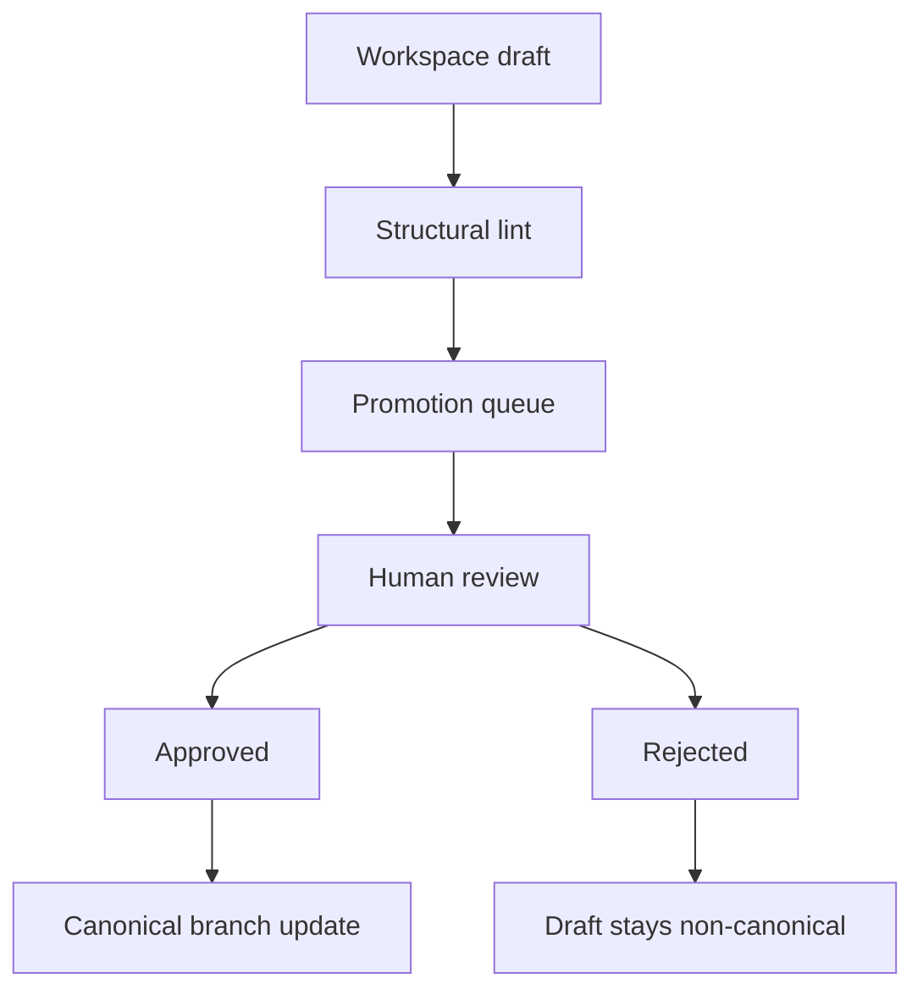

# Promotion and Canon Policy

This policy defines how draft knowledge becomes trusted canonical knowledge in this vault.

> [!INFO] Canon is supervised
> The agent may maintain `80 Knowledge Ops` freely, but important canonical changes still require human review through the promotion workflow.

## Why It Matters
The promotion boundary is the control point that prevents the agent-maintained workspace from silently becoming the truth layer.

## Promotion Map

## Lifecycle Rules
| State | Meaning | Allowed Read Use |
| :--- | :--- | :--- |
| `raw` | immutable source material | evidence only |
| `normalized` | structured source note | okay for source-aware synthesis |
| `draft` | agent-owned candidate artifact | do not treat as trusted canon |
| `canonical-candidate` | queued for human review | do not merge automatically |
| `promoted` | already integrated into canon | safe to reuse as canon context |
| `stale` | likely outdated or superseded | use with caution |
| `archived` | kept for history only | exclude from default active context |

> [!WARNING] No direct canon writes by default
> The agent should not skip the queue and silently rewrite important canonical notes as part of normal ingest or query work.

> [!IMPORTANT] Source ingest and canon promotion are separate approvals
> Approval to process a new source authorizes ingest, normalization, source notes, workspace drafts, and promotion candidates. It does not by itself authorize canonical edits.

## Review Rules
- review truth and scope separately from structure
- require a canonical target before promotion
- keep rejected candidates visible, but marked rejected
- when promotion edits an existing canonical note, preserve a clear diff trail
- large rewrites should be staged as candidate patches, not direct canonical replacements
- for source-driven updates, discuss key takeaways with the user before promoting
- require explicit human approval for promotion, not just general encouragement to process the source

## Promotion Approval Rule
Promotion to canon should happen only after the user explicitly approves the promotion step with language equivalent to:
- `promote this`
- `integrate it into the canon`
- `actualiza las notas canónicas`
- `sí, súbelo al vault`

General phrases such as `vamos a ello`, `procesa esta fuente`, or `haz la ingesta` should be interpreted as approval for ingest and workspace filing only.

## New Note vs Existing Note
| Situation | Default |
| :--- | :--- |
| existing canonical note already owns the concept | propose a patch |
| concept is real but canon has no stable page yet | propose a new note |
| source only adds noise or weak repetition | keep in workspace or reject |
| the idea is useful only for short-term operations | keep it in workspace, not canon |

## Related Notes
- Related: [[80 Knowledge Ops/30 Schemas and Policies/010 Knowledge Ops Schema|Knowledge Ops Schema]], [[80 Knowledge Ops/40 Registries and Logs/030 Promotion Queue|Promotion Queue]], [[095 Editorial Review Loops for AI-Maintained Knowledge|Editorial Review Loops for AI-Maintained Knowledge]]

## Sources
- [LLM Wiki | Andrej Karpathy](https://gist.github.com/karpathy/442a6bf555914893e9891c11519de94f)
- See [[095 Editorial Review Loops for AI-Maintained Knowledge|Editorial Review Loops for AI-Maintained Knowledge]]

## Last Reviewed
- 2026-04-21
