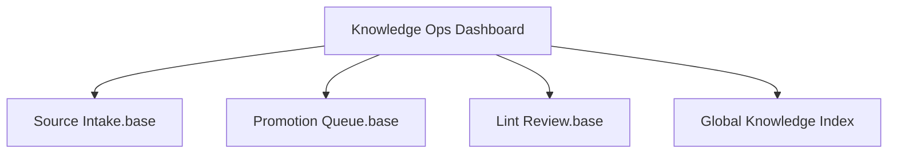

# Knowledge Ops Dashboard

This dashboard is the operational control surface for `80 Knowledge Ops`: source intake, draft workspaces, promotion candidates, and lint follow-up.

> [!INFO] Start here
> Use this note when you are operating the knowledge system rather than studying the canonical curriculum.

> [!IMPORTANT] Supports the canon, does not replace it
> `80 Knowledge Ops` is the runtime layer. The study path still begins in [[Home]] and the four main branch indexes.

## Ops Map


## Main Views
| View | Purpose | Open |
| :--- | :--- | :--- |
| `Knowledge Ops` | human-readable hub for the operating layer | [[80 Knowledge Ops/010 Knowledge Ops\|Knowledge Ops]] |
| `Source Intake` | browse normalized source notes by kind and state | [[80 Knowledge Ops/90 Dashboards/Source Intake.base\|Source Intake]] |
| `Promotion Queue` | review canonical candidates across domains | [[80 Knowledge Ops/90 Dashboards/Promotion Queue.base\|Promotion Queue]] |
| `Lint Review` | inspect stale and review-state signals in the ops layer | [[80 Knowledge Ops/90 Dashboards/Lint Review.base\|Lint Review]] |

## Bases Views
![[80 Knowledge Ops/90 Dashboards/Source Intake.base#By Source Kind]]

![[80 Knowledge Ops/90 Dashboards/Promotion Queue.base#By Domain]]

## Dataview Quick Signals
### Knowledge Ops By State
```dataview
TABLE rows.length AS "Notes"
FROM "80 Knowledge Ops"
WHERE type
GROUP BY knowledge_state
SORT knowledge_state ASC
```

### Pending Review
```dataview
TABLE file.link AS Note, type AS Type, knowledge_state AS "Knowledge State", review_state AS "Review State", target_domains AS "Target Domains"
FROM "80 Knowledge Ops"
WHERE review_state AND review_state != "approved"
SORT type ASC, file.name ASC
```

## Related Notes
- Related: [[80 Knowledge Ops/010 Knowledge Ops|Knowledge Ops]], [[80 Knowledge Ops/40 Registries and Logs/010 Global Knowledge Index|Global Knowledge Index]], [[80 Knowledge Ops/40 Registries and Logs/030 Promotion Queue|Promotion Queue]], [[80 Knowledge Ops/40 Registries and Logs/040 Lint Queue|Lint Queue]]

## Last Reviewed
- 2026-04-20
