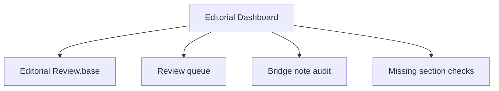

# Editorial Dashboard

This dashboard tracks review debt, note-class drift, and metadata exceptions across the vault.

> [!INFO] Start here
> Use this note when you are maintaining the vault, reviewing note quality, or planning the next cleanup pass.

> [!WARNING] Keep metadata honest
> Dashboards are only useful if `type`, `domain`, `status`, and `last_reviewed` are updated whenever notes change class, move folders, or get major rewrites.

## Maintenance Map


## Maintenance Views
| View | Purpose | Open |
| :--- | :--- | :--- |
| `Editorial Review` | grouped editorial Bases views by review date, status, and note class | [[90 Guides/Editorial Review.base\|Editorial Review]] |
| `Vault Dashboard` | top-level metadata portal and operational note browser | [[00 Home/Vault Dashboard\|Vault Dashboard]] |
| `Knowledge Ops Dashboard` | operational view for source intake, promotion candidates, and lint state | [[80 Knowledge Ops/90 Dashboards/010 Knowledge Ops Dashboard\|Knowledge Ops Dashboard]] |
| `Note Style Guide` | canonical authoring rules, curriculum rules, and dashboard policy | [[Note Style Guide]] |
| `AGENTS.md` | short operational contract for agents | [[AGENTS]] |

## Bases Views
![[90 Guides/Editorial Review.base#Review Queue]]

![[90 Guides/Editorial Review.base#Bridge Notes]]

## Review Queue
```dataview
TABLE file.link AS Note, domain AS Domain, type AS Type, status AS Status, last_reviewed AS "Last Reviewed"
FROM ""
WHERE type
SORT last_reviewed ASC, file.name ASC
LIMIT 15
```

## Remaining Bridge Notes
```dataview
TABLE file.link AS Note, domain AS Domain, last_reviewed AS "Last Reviewed"
FROM ""
WHERE type = "bridge"
SORT domain ASC, file.name ASC
```

## Missing Body Sections
```dataviewjs
const requiresSources = new Set(["concept", "research-log", "source", "policy"]);
const requiresLastReviewed = new Set(["concept", "research-log", "index", "guide", "dashboard", "source", "policy", "ops-log"]);
const rows = [];
for (const page of dv.pages().where(p => requiresSources.has(p.type) || requiresLastReviewed.has(p.type))) {
  const content = await dv.io.load(page.file.path);
  const hasSources = /^## Sources\b/m.test(content);
  const hasLastReviewed = /^## Last Reviewed\b/m.test(content);
  const expectSources = requiresSources.has(page.type);
  const expectLastReviewed = requiresLastReviewed.has(page.type);
  if ((expectSources && !hasSources) || (expectLastReviewed && !hasLastReviewed)) {
    rows.push([
      page.file.link,
      page.domain,
      expectSources ? (hasSources ? "OK" : "Missing") : "N/A",
      expectLastReviewed ? (hasLastReviewed ? "OK" : "Missing") : "N/A",
    ]);
  }
}

if (!rows.length) {
  dv.paragraph("All audited notes currently include the body sections expected for their type.");
} else {
  rows.sort((a, b) => String(a[1]).localeCompare(String(b[1])) || String(a[0]).localeCompare(String(b[0])));
  dv.table(["Note", "Domain", "Sources", "Body Last Reviewed"], rows);
}
```

## Recently Reviewed
```dataview
TABLE file.link AS Note, domain AS Domain, type AS Type, last_reviewed AS "Last Reviewed"
FROM ""
WHERE type
SORT last_reviewed DESC, file.name ASC
LIMIT 10
```

## Last Reviewed
- 2026-04-20
